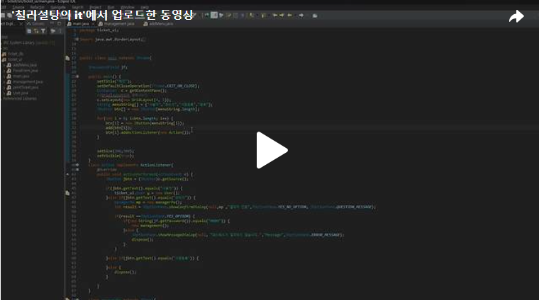

안녕하세요. 오늘은 Day9에 이어 관리자 버튼이 "0000"일때 생성되는 관리 폼을 만들어보도록 하겠습니다.<br>
오늘 만들어야 할 관리 폼은 아래의 그림입니다!<br>
<br>
<br>

<br>아래의 코드를 작성하면 [그림 2-18]과 같은 결과가 나오게 됩니다.<br>

<br>
<br>
이제 메뉴등록을 누르면 신규 메뉴 등록 폼이 나오도록 하겠습니다!<br>
<br>
<br>
[그림 2-19] 의 폼을 만들면서 조건 1), 조건2), 조건 3)을 충족해보겠습니다.<br>
조건 1), 조건2), 조건 3)을 충족시키기 위래 JComboBox를 사용했습니다.<br>

<br>
<br>

<br>조건 4)<br>
[등록] 버튼 클릭 시 [메뉴명] 항목에 값을 입력하지 않았을 경우, [그림 2-20]의 메시지가 출력되어 등록되지 않도록 하고, 값이 올바르게 입력되어 있으면 DB에 등록되고 [그림 2-21]의 메시지가 출력되도록 하시오.
<br>
[등록] 버튼 클릭 시 [메뉴명] 항목에 값을 입력하지 않았을 경우,  [그림 2-20]의 메시지가 출력되어 등록되지 않는 코드를 아래와 같이 작성했고 else구문에 있는 addMenu()함수는 값이 올바르게 입력됬으면 DB에 등록되고 [그림 2-21]의 메시지가 출력되는 함수입니다.
<br>

addMenu()함수입니다. <br>
meal 데이터베이스의 구조는 아래와 같기에 구조에 맞게 데이터를 삽입하는 구문을 짜도록 하겠습니다.<br>

<br>
<br>
변수 t는 추가하는 메뉴가 한식인지 중식인지 일식인지 양식인지 식별하는 식별자 변수입니다.<br>
현재 meal데이터베이스에 존재하는 mealNo중 최대값을 찾아 다음에 들어갈 메뉴의  mealNo번호를 알아냈으며, 조건에 todayMeal에 대한 정보는 없기에 우선 1로 설정했습니다.<br>

오늘은 이렇게 메뉴등록에 대해 코드를 작성해보았습니다!!<br>
코드 실행결과동영상입니다!!<br>

[](https://tv.kakao.com/v/449141889)<br>

```java
package ticket_ui;

import java.awt.BorderLayout;
import java.awt.Container;
import java.awt.GridLayout;
import java.awt.event.ActionEvent;
import java.awt.event.ActionListener;
import java.sql.Connection;
import java.sql.PreparedStatement;
import java.sql.ResultSet;
import java.sql.SQLException;
import java.sql.Statement;
import java.util.Vector;

import javax.swing.JButton;
import javax.swing.JComboBox;
import javax.swing.JFrame;
import javax.swing.JLabel;
import javax.swing.JOptionPane;
import javax.swing.JPanel;
import javax.swing.JTextField;

import com.mysql.cj.jdbc.Driver;
import com.mysql.cj.protocol.Resultset;

import ticket_db.Driver_connect;

public class addMenu extends JFrame{
	JTextField jt;
	JComboBox<String> jc;
	JComboBox<String> pricejc;
	JComboBox<String> maxcountjc;
	String maxNum;
	public addMenu() {
		setTitle("신규메뉴 등록");
		setDefaultCloseOperation(JFrame.EXIT_ON_CLOSE);
		Container c = getContentPane();
		
		add(new addMenuCenter());
		
		setSize(300,300);
		setVisible(true);
	}
	
	class addMenuCenter extends JPanel{
		public addMenuCenter() {
			setLayout(new GridLayout(5,2));
			String menuInfo[] = {"종류","*메뉴명","가격","조리가능수량"};
			String menuType[] = {"한식","중식","일식","양식"};
			Vector<String> v = new Vector<String>();
			Vector<String> pricev = new Vector<String>();
			Vector<String> maxcount = new Vector<String>();
			
			for(int i = 0; i<menuType.length; i++) {
				v.add(menuType[i]);
			}
			
			JLabel[] la = new JLabel[menuInfo.length];
			
			la[0] = new JLabel(menuInfo[0]);
			add(la[0]);
			
			jc = new JComboBox<String>(v);
			add(jc);
			
			la[1] = new JLabel(menuInfo[1]);
			add(la[1]);
			
			jt = new JTextField(15);
			add(jt);
			
			
			la[2] = new JLabel(menuInfo[2]);
			add(la[2]);
			
			for(int i = 1000; i<=12000; i=i+500) {
				pricev.add(Integer.toString(i));
			}
			pricejc = new JComboBox<String>(pricev);
			add(pricejc);
			
			la[3] = new JLabel(menuInfo[3]);
			add(la[3]);
			
			for(int i = 1; i<=50; i++) {
				maxcount.add(Integer.toString(i));
			}
			maxcountjc = new JComboBox<String>(maxcount);
			add(maxcountjc);
			
			
			String s[] = {"등록","닫기"};
			JButton btn[] = new JButton[s.length]; 
			
			for(int i = 0; i<btn.length; i++) {
				btn[i] = new JButton(s[i]);
				add(btn[i]);
				btn[i].addActionListener(new menusign());
			}
		}
		class menusign implements ActionListener{
			@Override
			public void actionPerformed(ActionEvent e) {
				
				JButton btn = (JButton)e.getSource();
				if(btn.getText().equals("등록")) {
					if(jt.getText().equals("")) {
						JOptionPane.showMessageDialog(null, "메뉴명을 입력해주세요","Message",JOptionPane.ERROR_MESSAGE);
					}else {
						addMenu();
					}
				}else {
					dispose();
				}
			}
		}
	}
	
	public void addMenu() {
		Connection con = Driver_connect.makeConnection("ticket");
		String menuinsert = "insert into meal values(?, ?, ?, ?, ?, ?)";
		PreparedStatement psmt = null;
		
		int t;
		
		if(jc.getSelectedItem().equals("한식")) {
			t = 1;
		}else if (jc.getSelectedItem().equals("중식")) {
			t = 2;
		}else if (jc.getSelectedItem().equals("일식")) {
			t = 3;
		}else {
			t = 4;
		}
		
		int newMenuNumber;
		
		String findMaxNumber = "select max(mealNo) from meal";
		
		ResultSet rs;
		try {
			Statement stmt = con.createStatement();
			rs = stmt.executeQuery(findMaxNumber);
			
			while(rs.next()) {
				maxNum = rs.getString(1);
				System.out.println(maxNum);
			}
			
			rs.close();
		} catch (SQLException e) {
			// TODO Auto-generated catch block
			e.printStackTrace();
		}
			
		try {
			psmt = con.prepareStatement(menuinsert);
			
			psmt.setString(1, Integer.toString(Integer.parseInt(maxNum)+1));
			psmt.setString(2, Integer.toString(t));
			psmt.setString(3, jt.getText());
			psmt.setString(4, (String) pricejc.getSelectedItem());
			psmt.setString(5, (String)maxcountjc.getSelectedItem());
			psmt.setString(6, "1");

			psmt.executeUpdate();
			JOptionPane.showMessageDialog(null, "메뉴가 정상적으로 등록되었습니다");
			
		} catch (SQLException e) {
			// TODO Auto-generated catch block
			e.printStackTrace();
		}
	}
	
//	public static void main(String[] args) {
//		new addMenu();
//
//	}

}


