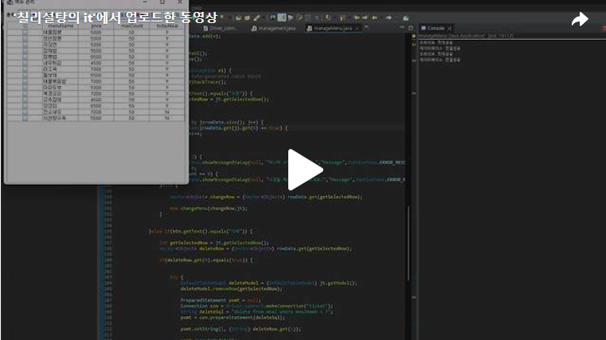

안녕하세요. Day10에서 만든 관리폼에서 메뉴관리 폼을 만들어보도록 하겠습니다.<br>
<br>


<br>

그림[2-22]에 보이는 것 처럼 메뉴관리 폼의 틀을 만들어보도록 하겠습니다.<br>
그림[2-22]를 보면 평상시 만들던 것과 다르게 "□"과 같이 JTable안에 Checkbox로 선택이 가능하게 되어있습니다.<br>
[블로그 바로가기](https://chillysugar-study.tistory.com/35)
==>JTable안에 Checkbox를 넣는 방법은 포스팅 해두었으니 필요하신분들은 확인하시면 감사하겠습니다.<br>
<br>
<br>
<br>
<br>
위와 같이 코드를 작성하고 실행을 시켜주면 아래의 그림과 같이 결과가 나오게 됩니다.
<br>
<br>

위의 코드를 통래 조건1)과 조건3)에 대해서는 만족하게 만들었습니다.<br>
이제 남은 조건에 대해 진행해보도록 하겠습니다.<br>

 

<br>조건 2) / 조건 4)<br>
조건2) [메뉴 관리] 폼 실행 시 테이블에는 [종류]에 맞는 메뉴가 조회되어 출력되도록 하시오.<br>
<br>
조건 4) [종류]를 변경하고 [검색] 버튼을 누르면 테이블의 데이터가 [종류]에 맞게 조회되도록 하시오.<br>
<br>
meal데이터베이스에 보면 todayMeal은 0또는 1로 설정이 되어있습니다. 하지만 그림[2-22]를 보면 Y/N으로 설정이 되어있기에 만일 todayMeal이 1이면 Y로 바꾸어 JTable에 넣고 0이면 N으로 바꾸어 JTable에 넣는 작업을 진행했습니다.
<br>

<br>조건 5)<br>
조건 5) [수정] 버튼 클릭 시 수정할 레코드에 체크 표시를 하지 않았을 경우 [그림 2-23]의 메시지가, 두 개 이상 체크 표시를 하였을 경우 [그림 2-24]의 메시지가 출력되도록 하고, 이 외에는 [그림 2-24]와 같이 [메뉴 수정] 폼이 실행되도록 하시오.
<br>JTable에서 0번째 열의 true개수를 확인하여 2개이상이면 하나씩 수정이 가능하다는 문구를 나타내고 하나도 선택이 되지 않은 상태로 수정버튼을 누르면 수정할 메뉴를 선택하라는 문구가 나오도록 하였습니다.<br>

<br>
수정 버튼을 눌렀을때 메뉴를 체크한 버튼이 1개이면 그림[2-25]가 나와야 합니다.

 

<br>조건 6) / 조건7) / 조건 8)<br>
조건 6) [그림 2-25] [메뉴 수정] 폼의 기본 기능은 [그림 2-19] [신규 메뉴 등록] 폼과 동일하게 적용하시오.<br>
조건 7) [메뉴 수정] 폼에서 항목을 수정하고 [수정] 버튼을 누르면 [그림 2-26]의 메시지가 출력되고 폼이 종료되도록 하시오.<br>
조건 8) [닫기] 버튼을 누르면 폼이 종료되도록 하시오.<br>
<br>
수정버튼을 눌렀을때 체크된 메뉴에 대한 정보를 알아야 하기에 Jtable과 선택된 행에 대한 정보를 매개변수로 설정하겠습니다.<br>
<br>

<br>
Day10에서 만든 신규메뉴등록 폼과 동일하기에 메뉴명만 선택된 행의 메뉴 이름이 메뉴수정폼에 들어가도록 하겠습니다. 그리고 수정 버튼을 눌렀을때 meal데이터베이스도 수정이 되는 구문을 작성하겠습니다.<br>

<br>


<br>조건 9)<br>
조건 9) [메뉴 관리] 폼에서 삭제할 레코드의 체크 박스에 체크 표시를 하고 [삭제] 버튼을 클릭하면 해당 레코드가 DB에서 삭제되도록 하고, 테이블의 내용이 갱신되도록 하시오.<br>
<br>
<br>
<br>조건 10) /조건 11)<br>
조건 10) [메뉴 관리] 폼에서 [오늘의메뉴 선정] 버튼 클릭 시 25개를 초과하여 레코드에 체크 표시를 하였을 경우, [그림 2-27]의 메시지가 출력되고, 25개 이하의 레코드에 체크 표시를 하였을 경우 기존 ‘오늘의메뉴’가 설정된 메뉴들이 모두 초기화되고, 체크 박스에 체크 표시 된 레코드의 메뉴만 ‘오늘의메뉴’로 설정되도록 하시오(0 – N, 1 – Y).<br>
<br>
조건 11) [닫기] 버튼을 누르면 폼이 종료되도록 하시오.<br>
<br>
<br>
JTable에서 Checkbox가 선택된 메뉴의 개수를 확인후 25개 이상이면 JOptionPane이 나타나게 하고 이하면 meal데이터베이스의  todayMeal항목을 모두 0으로 초기화 한 후 Checkbox가 선택된 메뉴에 대해 다시 todayMeal항목을 1로 바꾸는 작업을 진행했습니다.<br>

<br>

이렇게 조건들에 대해 전부 충족하게 만들었습니다.<br>
아래는 오늘 만든 조건에 대한 동영상입니다!<br>

[](https://tv.kakao.com/v/449379051)<br>

아래는 전체적인 코드입니다.<br>

```java
package ticket_ui;

import java.awt.BorderLayout;
import java.awt.Container;
import java.awt.FlowLayout;
import java.awt.event.ActionEvent;
import java.awt.event.ActionListener;
import java.awt.event.MouseAdapter;
import java.awt.event.MouseEvent;
import java.sql.Connection;
import java.sql.PreparedStatement;
import java.sql.ResultSet;
import java.sql.SQLException;
import java.sql.Statement;
import java.util.Vector;

import javax.swing.JButton;
import javax.swing.JComboBox;
import javax.swing.JFrame;
import javax.swing.JLabel;
import javax.swing.JOptionPane;
import javax.swing.JScrollPane;
import javax.swing.JTable;
import javax.swing.SwingConstants;
import javax.swing.table.DefaultTableCellRenderer;
import javax.swing.table.DefaultTableModel;
import javax.swing.table.TableColumnModel;

import ticket_db.Driver_connect;

public class manageMenu extends JFrame{
	JTable jt;
	Vector<Vector<Object>> rowData;
	JComboBox<String> jc;
	String cuisineNo;
	String JTable_Name[] = {"□", "menuName", "price", "maxCount","todayMeal"};
	DefaultTableModel dt;
	Vector<String> colData = new Vector<String>();
	int Count;
	
	
	public manageMenu() {
		setTitle("메뉴 관리");
		Container c = getContentPane();
		setLayout(new FlowLayout(FlowLayout.CENTER));
		
		String managebtn[] = {"검색", "수정", "삭제", "오늘의 메뉴 선정", "닫기"};
		String comboBox[] = {"한식","중식","일식","양식"};
		JLabel la = new JLabel("종류");
		
		jc = new JComboBox<String>(comboBox);
		
		add(la); add(jc);
		
		JButton btn[] = new JButton[managebtn.length];
		for(int i = 0; i<btn.length; i++) {
			btn[i] = new JButton(managebtn[i]);
			add(btn[i]);
			btn[i].addActionListener(new Action());
		}
		
		rowData = new Vector<Vector<Object>>();
		
		
		for(int i = 0; i<JTable_Name.length; i++) {
			colData.add(JTable_Name[i]);
		}
		//□을 만들기 위해 사용
		dt = new DefaultTableModel(rowData, colData) {
			public java.lang.Class<?> getColumnClass(int columnIndex) {
				switch(columnIndex){
				
				case 0:
					return Boolean.class;
				default:
					return String.class;
				}
			};
		};
		
		jt = new JTable(dt);
		JScrollPane jps = new JScrollPane(jt);
		add(jps, BorderLayout.CENTER);
		
		jt.getTableHeader().addMouseListener(new MouseAdapter() {
            @Override
            public void mouseClicked(MouseEvent e) {
                int column = jt.columnAtPoint(e.getPoint());
                //선택 열을 누를경우
                if (column == 0) {  
                    boolean allSelected = check();
                    allcheck(!allSelected);
                }
            }
        });
		//JTable안에 존재하는 정보들 가운데 정렬
		DefaultTableCellRenderer centerModel = new DefaultTableCellRenderer();
		centerModel.setHorizontalAlignment(SwingConstants.CENTER);
		TableColumnModel tcm = jt.getColumnModel();
		
		for(int i=2; i<tcm.getColumnCount(); i++) {
			tcm.getColumn(i).setCellRenderer(centerModel);
		}
		
		
		setSize(500,500);
		setVisible(true);
	}
	 // 모든 체크박스가 선택되었는지 확인하는 메소드
    private boolean check() {
        for (int i = 0; i < jt.getRowCount(); i++) {
            if (!(Boolean) jt.getValueAt(i, 0)) {
                return false; 
            }
        }
        return true; 
    }

    // 모든 체크박스를 선택/해제하는 메소드
    private void allcheck(boolean select) {
        for (int i = 0; i < jt.getRowCount(); i++) {
            jt.setValueAt(select, i, 0);
        }
    }
	
	class Action implements ActionListener{
		@Override
		public void actionPerformed(ActionEvent e) {
			JButton btn = (JButton)e.getSource();
			
			if(btn.getText().equals("검색")) {
				if(jc.getSelectedItem().equals("한식")) {
					cuisineNo = "1";
				}else if(jc.getSelectedItem().equals("중식")){
					cuisineNo = "2";
				}else if(jc.getSelectedItem().equals("일식")) {
					cuisineNo = "3";
				}else {
					cuisineNo = "4";
				}
				String sql = "select mealName,price,maxCount,todayMeal from meal where cuisineNo = "+cuisineNo;
				try {
					rowData.clear();
					Connection con = Driver_connect.makeConnection("ticket");
					Statement stmt;
					stmt = con.createStatement();
					ResultSet rs = stmt.executeQuery(sql);
					
					while(rs.next()) {
						Vector<Object> v = new Vector<Object>();
						v.add(false);
						for(int i = 0; i<JTable_Name.length-1; i++) {
							v.add(rs.getString(i+1));
							
							}
						if(v.get(JTable_Name.length-1).equals("1")) {
							v.set(JTable_Name.length-1, "Y");
						}else if(v.get(JTable_Name.length-1).equals("0")) {
							v.set(JTable_Name.length-1, "N");
						}
						rowData.add(v);
					}
					
					jt.updateUI();
					con.close();
					
				} catch (SQLException e1) {
					// TODO Auto-generated catch block
					e1.printStackTrace();
				}
			}else if(btn.getText().equals("수정")) {
				int getSelectedRow = jt.getSelectedRow();
				
				
					
				for(int j = 0; j<rowData.size(); j++) {
					if((Boolean)rowData.get(j).get(0) == true) {
						Count++;
					}
				}		
				
				if(Count >= 2) {
					JOptionPane.showMessageDialog(null, "하나씩 수정 가능합니다.","Message",JOptionPane.ERROR_MESSAGE);
					Count = 0;
				}else if(Count == 0) {
					JOptionPane.showMessageDialog(null, "수정할 메뉴를 선택해주세요.","Message",JOptionPane.ERROR_MESSAGE);
				}else {
					
					Vector<Object> changeRow = (Vector<Object>) rowData.get(getSelectedRow);
					
					new changeMenu(changeRow,jt);
				}
				
				
			}else if(btn.getText().equals("삭제")) {
				
				int getSelectedRow = jt.getSelectedRow();
				Vector<Object> deleteRow = (Vector<Object>) rowData.get(getSelectedRow);
					
				if(deleteRow.get(0).equals(true)) {
					
					
					try {
						DefaultTableModel deleteModel = (DefaultTableModel) jt.getModel();
						deleteModel.removeRow(getSelectedRow);
						
						PreparedStatement psmt = null;
						Connection con = Driver_connect.makeConnection("ticket");
						String deleteSql = "delete from meal where mealName = ?";
						psmt = con.prepareStatement(deleteSql);
						
						psmt.setString(1, (String) deleteRow.get(1));
						
						psmt.executeUpdate();
						
					} catch (SQLException e1) {
						// TODO Auto-generated catch block
						e1.printStackTrace();
					}
						
					
				}
				 
			}else if(btn.getText().equals("오늘의 메뉴 선정")) {
				int todayMealCount = 0;
				for(int j = 0; j<rowData.size(); j++) {
					if((Boolean)rowData.get(j).get(0) == true) {
						todayMealCount++;
					}
				}
				
				int getSelectedRow = jt.getSelectedRow();
				Vector<Object> todayMealRow = (Vector<Object>) rowData.get(getSelectedRow);
				
				
				if (todayMealCount>25) {
					JOptionPane.showMessageDialog(null, "25개를 초과할 수 없습니다.","Message",JOptionPane.ERROR_MESSAGE);
				}else {
					
					PreparedStatement psmt = null;
					PreparedStatement psmt1 = null;
					Connection con = Driver_connect.makeConnection("ticket");
					String sql = "update meal set todayMeal = ?";
					String sql1 = "update meal set todayMeal = 1 where mealName = ?";
					try {
						psmt = con.prepareStatement(sql);
						psmt.setString(1, "0");
						jt.updateUI();
						psmt.executeUpdate();
						
						psmt.close();
						
					} catch (SQLException e1) {
						// TODO Auto-generated catch block
						e1.printStackTrace();
					}
					
					for(int j = 0; j<rowData.size(); j++) {
						if((Boolean)rowData.get(j).get(0) == true) {
							
							try {
								psmt1 = con.prepareStatement(sql1);
								psmt1.setString(1, (String) rowData.get(j).get(1));
				
								psmt1.executeUpdate();
								jt.updateUI();
								psmt1.close();
							} catch (SQLException e1) {
								// TODO Auto-generated catch block
								e1.printStackTrace();
							}
							
						}
					}
				}
			}else {
				dispose();
			}
			
		}
	}

	public static void main(String[] args) {
		new manageMenu();

	}

}
```
<br>
수정버튼을 눌렀을때 생성되는 폼에대한 코드입니다.<br>

```java
package ticket_ui;

import java.awt.Container;
import java.awt.GridLayout;
import java.awt.event.ActionEvent;
import java.awt.event.ActionListener;
import java.sql.Connection;
import java.sql.PreparedStatement;
import java.sql.ResultSet;
import java.sql.SQLException;
import java.sql.Statement;
import java.util.Vector;

import javax.swing.JButton;
import javax.swing.JComboBox;
import javax.swing.JFrame;
import javax.swing.JLabel;
import javax.swing.JOptionPane;
import javax.swing.JPanel;
import javax.swing.JTable;
import javax.swing.JTextField;

import ticket_db.Driver_connect;
import ticket_ui.addMenu.addMenuCenter;
import ticket_ui.addMenu.addMenuCenter.menusign;

public class changeMenu extends JFrame{
	JTextField jt;
	JTable jtable;
	JComboBox<String> jc;
	JComboBox<String> pricejc;
	JComboBox<String> maxcountjc;
	String maxNum;
	Vector<Object> vo;

	
	public changeMenu(Vector<Object> v, JTable jtable) {
		this.vo = v;
		this.jtable = jtable;
		setTitle("메뉴 수정");
		setDefaultCloseOperation(JFrame.EXIT_ON_CLOSE);
		Container c = getContentPane();
		
		add(new addMenuCenter());
		
		setSize(300,300);
		setVisible(true);
	}
	
	class addMenuCenter extends JPanel{
		public addMenuCenter() {
			setLayout(new GridLayout(5,2));
			
			String menuInfo[] = {"종류","*메뉴명","가격","조리가능수량"};
			String menuType[] = {"한식","중식","일식","양식"};
			Vector<String> v = new Vector<String>();
			Vector<String> pricev = new Vector<String>();
			Vector<String> maxcount = new Vector<String>();
			
			for(int i = 0; i<menuType.length; i++) {
				v.add(menuType[i]);
			}
			
			JLabel[] la = new JLabel[menuInfo.length];
			
			la[0] = new JLabel(menuInfo[0]);
			add(la[0]);
			
			jc = new JComboBox<String>(v);
			add(jc);
			
			la[1] = new JLabel(menuInfo[1]);
			add(la[1]);
			
			jt = new JTextField((String) vo.get(1));
			jt.setEnabled(false);
			add(jt);
			
			
			la[2] = new JLabel(menuInfo[2]);
			add(la[2]);
			
			for(int i = 1000; i<=12000; i=i+500) {
				pricev.add(Integer.toString(i));
			}
			pricejc = new JComboBox<String>(pricev);
			add(pricejc);
			
			la[3] = new JLabel(menuInfo[3]);
			add(la[3]);
			
			for(int i = 1; i<=50; i++) {
				maxcount.add(Integer.toString(i));
			}
			maxcountjc = new JComboBox<String>(maxcount);
			add(maxcountjc);
			
			
			String s[] = {"수정","닫기"};
			JButton btn[] = new JButton[s.length]; 
			
			for(int i = 0; i<btn.length; i++) {
				btn[i] = new JButton(s[i]);
				add(btn[i]);
				btn[i].addActionListener(new btnAction());
				
			}
		}
	class btnAction implements ActionListener{	
		@Override
		public void actionPerformed(ActionEvent e) {
			JButton btn = (JButton)e.getSource();
			
			if(btn.getText().equals("수정")) {
				UpdateMenu();
			}else {
				dispose();
			}
		}
	}
	
	public void UpdateMenu() {
		try {
			PreparedStatement psmt = null;
			Connection con = Driver_connect.makeConnection("ticket");
			String changeMenuSql = "update meal set price = ?,maxCount = ? where mealName = ?";
			psmt = con.prepareStatement(changeMenuSql);
			
			psmt.setString(1, (String) pricejc.getSelectedItem());
			psmt.setString(2, (String) maxcountjc.getSelectedItem());
			psmt.setString(3, jt.getText());
			
			psmt.executeUpdate();
			
			JOptionPane.showMessageDialog(null, "메뉴가 정상적으로 수정되었습니다");
			dispose();
			
			jt.updateUI();
			
		} catch (SQLException e) {
			// TODO Auto-generated catch block
			e.printStackTrace();
			}
		}
	}
	
}


