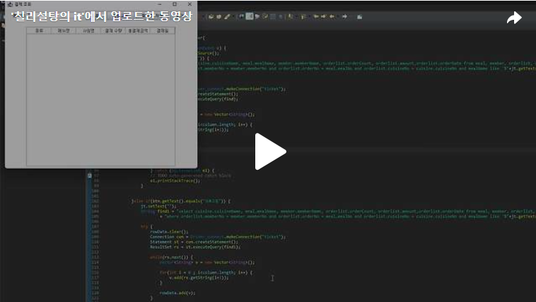

안녕하세요. 오늘은 결제관리 폼에 대해 만들어보도록 하겠습니다.<br>


결제조회의 폼의 상단의 JButton에 "조회", "새로고침", "인쇄", "닫기"에 대한 버튼이 존재합니다. 하지만 제가 "인쇄"버튼을 눌렀을때 원하는 결과값이 나오지 않아 추후에 제대로 나오게 된다면 수정을 하도록 하겠습니다.<br>
우선 "인쇄" 대신에 [그림 2-31]에 보이는 것처럼 저장 파일이 바탕화면에 저장되도록 하겠습니다. 양해부탁드립니다!<br>
[그림 2-28]에 보이는 것처럼 폼의 틀을 만들어보도록 하겠습니다.<br>
<br>
<br>
위의 코드를 작성하면 아래의 결과물이 나오게 됩니다. 이제 조건들을 충족하도록 만들어보도록 하겠습니다.<br>
<br>

<br>
<br>조건 1) / 조건 2)<br>
조건 1: [결제 조회] 폼의 테이블에는 현재까지 결제된 내역들이 조회되도록 하시오.<br>
조건 2: [메뉴명] 텍스트란에 검색할 내용을 입력하고 [조회] 버튼을 누르면 [그림 2-29]와 같이 해당 검색 내용과 일치한 레코드가 조회되도록 하시오(메뉴명의 일부만 입력되어도 조회가 가능함).<br>

<br>현재까지 결제된 내역들이 조회되도록 해야하기에 저희는 데이터베이스중 Orderlist의 데이터베이스의 정보가 호출되도록 하면 될 것입니다. 또한 조건 2에 보면 메뉴명의 일부만 입력해도 조회가 가능해야 하기에 Sqld문장에 like 구문을 사용했습니다.<br>
<br>

<br>조건 3)<br>

조건 3: [새로고침] 버튼을 누르면 [메뉴명] 텍스트란이 초기화되고 [그림 2-28]과 같이 되도록 하시오.<br>
[메뉴명] 텍스트란이 초기화 되어야 하기에 jt.setText(" ")를 통해 공백을 만들고 조건1) / 조건2)에 사용했던 구문을 사용하겠습니다.<br>
<br><br>


<br>조건 4) / 조건 5)<br>
조건 4: 조건4는 조금 수정하여 바탕화면에 Orderlist에 저장된 내용을 바탕화면에 저장하도록 하겠습니다.<br>
조건 5: [닫기] 버튼을 누르면 폼이 종료되도록 하시오.<br>

<br>

이렇게 오늘은 결제관리 폼에 대해 해결 해보았습니다. 아래는 오늘 작성한 코드에 대한 결과값 입니다!<br>

[](https://tv.kakao.com/v/449582498)<br>

```java
package ticket_ui;

import java.awt.BorderLayout;
import java.awt.Container;
import java.awt.FileDialog;
import java.awt.event.ActionEvent;
import java.awt.event.ActionListener;
import java.io.FileWriter;
import java.io.IOException;
import java.sql.Connection;
import java.sql.ResultSet;
import java.sql.SQLException;
import java.sql.Statement;
import java.util.Vector;

import javax.swing.JButton;
import javax.swing.JFrame;
import javax.swing.JLabel;
import javax.swing.JPanel;
import javax.swing.JScrollPane;
import javax.swing.JTable;
import javax.swing.JTextField;

import ticket_db.Driver_connect;

public class payMenu extends JFrame{
	
	String s[] = {"조회", "새로고침", "파일로 저장", "닫기"};
	String column[] = {"종류","메뉴명", "사원명","결제 수량", "총결제금액", "결제일"};
	Vector<Vector<String>> rowData = new Vector<Vector<String>>();
	Vector<String> colData = new Vector<String>();
	JTable jtable;
	JTextField jt;
	
	public payMenu() {
		
		
		setTitle("결제 조회");
		setDefaultCloseOperation(JFrame.EXIT_ON_CLOSE);
		
		Container c = getContentPane();
		setLayout(new BorderLayout());
		
		add(new Top(), BorderLayout.NORTH);
		add(new Center(), BorderLayout.SOUTH);
		setSize(600,520);
		setVisible(true);
			
	}
	
	class Top extends JPanel{
		public Top() {
			JLabel la = new JLabel("메뉴명: ");
			jt = new JTextField(15);
			
			add(la);
			add(jt);
			
			JButton btn [] = new JButton[s.length];
			
			for(int i = 0; i<s.length; i++) {
				btn[i] = new JButton(s[i]);
				add(btn[i]);
				btn[i].addActionListener(new Action());
			}
		}
			
	}
	
	class Action implements ActionListener{
		@Override
		public void actionPerformed(ActionEvent e) {
			JButton btn = (JButton)e.getSource();
			if(btn.getText().equals("조회")) {
				String find = "select cuisine.cuisineName, meal.mealName, member.memberName, orderlist.orderCount, orderlist.amount,orderlist.orderDate from meal, member, orderlist, cuisine "
						+ "where orderlist.memberNo = member.memberNo and orderlist.orderNo = meal.mealNo and orderlist.cuisineNo = cuisine.cuisineNo and mealName like '%"+jt.getText()+"%';";
				
				try {
					rowData.clear();
					Connection con = Driver_connect.makeConnection("ticket");
					Statement st = con.createStatement();
					ResultSet rs = st.executeQuery(find);
					
					while(rs.next()) {
						Vector<String> v = new Vector<String>();
						
						for(int i = 0 ; i<column.length; i++) {
							v.add(rs.getString(i+1));
						}
						
						rowData.add(v);
					}
					
					
					jtable.updateUI();
					} catch (SQLException e1) {
					// TODO Auto-generated catch block
					e1.printStackTrace();
				}
				
				
			}else if(btn.getText().equals("새로고침")) {
				jt.setText("");
				String find1 = "select cuisine.cuisineName, meal.mealName, member.memberName, orderlist.orderCount, orderlist.amount,orderlist.orderDate from meal, member, orderlist, cuisine "
						+ "where orderlist.memberNo = member.memberNo and orderlist.orderNo = meal.mealNo and orderlist.cuisineNo = cuisine.cuisineNo and mealName like '%"+jt.getText()+"%';";
				
				try {
					rowData.clear();
					Connection con = Driver_connect.makeConnection("ticket");
					Statement st = con.createStatement();
					ResultSet rs = st.executeQuery(find1);
					
					while(rs.next()) {
						Vector<String> v = new Vector<String>();
						
						for(int i = 0 ; i<column.length; i++) {
							v.add(rs.getString(i+1));
						}
						
						rowData.add(v);
					}
					
					
					jtable.updateUI();
					} catch (SQLException e1) {
					// TODO Auto-generated catch block
					e1.printStackTrace();
				}
				
				
			}else if(btn.getText().equals("파일로 저장")) {
				JFrame f = new JFrame();
				f.setSize(350,250);
				f.setLayout(null);
				f.setVisible(false);
				
				FileDialog dialog = new FileDialog(f,"텍스트 파일로 저장하기",FileDialog.SAVE);
				dialog.setVisible(true);
				
				String path = dialog.getDirectory()+dialog.getFile();
				
				try {
					FileWriter w = new FileWriter(path);
					w.write("종류  \t\t메뉴명    \t\t사원명  \t\t결제 수량  \t\t총 결제금액  \t\t결제일  \r\n\n");
					
					for(int i = 0; i<jtable.getRowCount(); i++) {
						Vector<String> v = (Vector<String>) rowData.get(i);
						Vector<String> v1 = new Vector<String>();
						for(int t=0; t<=5; t++) {
							v1.add(v.get(t));
							w.write(v1.get(t)+"    \t\t");
							
							
						}
						w.write("\r\n");
					}
					w.close();
				} catch (IOException e1) {
					// TODO Auto-generated catch block
					e1.printStackTrace();
				}
				
			}else {
				dispose();
			}
			
		}
	}
	
	class Center extends JPanel{
		public Center() {
			
			for(int i = 0; i<column.length; i++) {
				colData.add(column[i]);
			}
			
			jtable = new JTable(rowData, colData);
			JScrollPane jps = new JScrollPane(jtable);
			add(jps, BorderLayout.CENTER);
			
			
		}
	}
	
	
	public static void main(String[] args) {
		new payMenu();

	}

}


 

 
