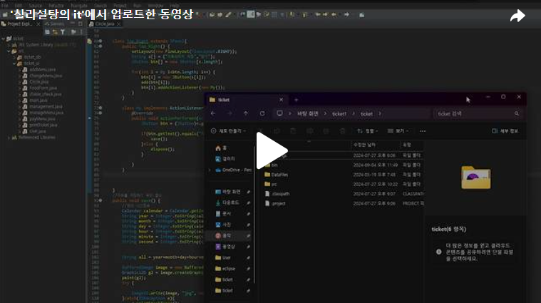

안녕하세요. 이번 프로젝트의 마지막을 달려가고 있습니다.<br>
오늘은 Day12에 이어 현재까지 결제된 메뉴의 통계차트를 만들어 보도록 하겠습니다.<br>


<br>

[그림 2-32]를 보면 아래의 그림처럼 나누어서 만들도록 하겠습니다.<br>


<br>
첫번째 그림은 FlowLayout을 이용해 순서대로 "종류별 결제건수 통계차트" Label과 "차트이미지저장", "닫기" 버튼을 순서대로 넣겠습니다.<br>

<br>
 
두번째 그림은 데이터베이스의 Orderlist에서 존재하는 한식/일식/양식/중식 중 각 분야가 전체에서 차지하는 백분율을 그림으로 나타낸 것입니다.<br>
우선 Orderlist데이터베이스에 존재하는 데이터중에서 각 분야별 주문된 개수를 조회하고 벡터에 저장을 하겠습니다. <br>

<br>

이제 벡터에 저장된 정보를 가져와 원을 그리고 원색상은 종류별로 랜덤으로 나타나도록 하겠습니다. 원을 그리기 위해 paintComponent 이용하였습니다.<br>
<br>

이렇게 하면 아래의 그림과 같이 결과가 나오게 됩니다. Day12에서 한식과 일식에 관한 메뉴만 결제를 했기에 아래의 그림과 같이 결과가 나오게 됩니다.<br>
<br>

이제 "차트이미지 저장" 과 "닫기"버튼에 대한 메소드를 작성하도록 하겠습니다.<br>
차트이미지 저장을 할때 "파일명은 년월일시분초-종류별결제현황차트.jpg라는 이름으로 생성한다."라는 조건이 있기에 Calendar클래스를 이용해 현재 날짜를 받아오고 Day8에서 진행했던것과 같이 이미지를 캡쳐해 저장하였습니다.<br>

<br>

 

오늘은 이렇게 지금까지 결제된 목록의 종류에 따른 백분율 그림을 그려봤습니다. <br>
아래는 오늘 작업한 코드의 결과물입니다.<br>

[](https://tv.kakao.com/v/449648245)<br>


```java
package ticket_ui;

import java.awt.BorderLayout;
import java.awt.Color;
import java.awt.Container;
import java.awt.FlowLayout;
import java.awt.Graphics;
import java.awt.Graphics2D;
import java.awt.event.ActionEvent;
import java.awt.event.ActionListener;
import java.awt.image.BufferedImage;
import java.io.File;
import java.io.IOException;
import java.sql.Connection;
import java.sql.PreparedStatement;
import java.sql.ResultSet;
import java.sql.SQLException;
import java.sql.Statement;
import java.util.Calendar;
import java.util.Vector;

import javax.imageio.ImageIO;
import javax.swing.JButton;
import javax.swing.JFrame;
import javax.swing.JLabel;
import javax.swing.JPanel;
import ticket_db.Driver_connect;

public class Circle extends JFrame{
	Container c;
	public Circle(){
		setTitle("종류별 결제현황차트");
		
		c = getContentPane();
		
		setLayout(new BorderLayout());
		add(new Top(), BorderLayout.NORTH);
		add(new Center(), BorderLayout.CENTER);
		setSize(500,500);
		setVisible(true);
	}
	
	class Top extends JPanel{
		public Top(){
			
			add(new Top_center());
			add(new Top_Right());
			
		}
	}
	
	class Top_center extends JPanel{
		public Top_center() {
			JLabel la = new JLabel("종류별 결제건수 통계차트");
			add(la);
		}
	}
	
	
	class Top_Right extends JPanel{
		public Top_Right() {
			setLayout(new FlowLayout(FlowLayout.RIGHT));
			String s[] = {"차트이미지 저장","닫기"};
			JButton btn[] = new JButton[s.length];
			
			for(int i = 0; i<btn.length; i++) {
				btn[i] = new JButton(s[i]);
				add(btn[i]);
				btn[i].addActionListener(new My());
			}
		}
		
		class My implements ActionListener{
			@Override
			public void actionPerformed(ActionEvent e) {
				JButton btn = (JButton)e.getSource();
				
				if(btn.getText().equals("차트이미지 저장")) {
					save();
				}else {
					dispose();
				}
				
			}
		}
		
		

	}
	//차트를 저장하기 위한 함수
	public void save() {
		//현재 시간정보
		Calendar calendar = Calendar.getInstance();
		String year = Integer.toString(calendar.get(Calendar.YEAR));
		String month = Integer.toString(calendar.get(Calendar.MONTH) + 1);
		String day = Integer.toString(calendar.get(Calendar.DAY_OF_MONTH));
		String hour = Integer.toString(calendar.get(Calendar.HOUR_OF_DAY));
		String minute = Integer.toString(calendar.get(Calendar.MINUTE));
		String second = Integer.toString(calendar.get(Calendar.SECOND));

		
		String all = year+month+day+hour+minute+second+"-";
		
		BufferedImage image = new BufferedImage(getWidth(), getHeight(), BufferedImage.TYPE_INT_RGB);
		Graphics2D g2 = image.createGraphics();
		paint(g2);
		try {
			
			ImageIO.write(image, "jpg", new File(all+"현재차트.jpg"));
		}catch(IOException e){
			e.printStackTrace();
		}
		
	}
	
	class Center extends JPanel{
		JLabel la[] = new JLabel[4];
		String cuisineNo[] = {"1","2","3","4"};
		String label[] = {"한식","일식","중식","양식"};
		Vector<String> v = new Vector<String>();
		int sum = 0;
		
		public Center() {
			Connection con = Driver_connect.makeConnection("ticket");
			
			for(int i = 0; i< cuisineNo.length; i++) {
				String getCount = "select sum(orderCount) from orderlist where cuisineNo = "+cuisineNo[i];
				try {
					Statement st = con.createStatement();
					ResultSet rs = st.executeQuery(getCount);
					
					while(rs.next()) {
						 String count = rs.getString(1); 
						 if (count == null) { 
						       count = "0"; 
						 }
						 v.add(count);
						 sum = sum + Integer.parseInt(count); 
					}
				}catch (SQLException e1) {
					// TODO Auto-generated catch block
					e1.printStackTrace();
				}
			}
						
		}
		Color c[] = new Color[4];
		
		//타원을 그리기 위해 paintComponent를 Override
		@Override
		protected void paintComponent(Graphics g) {
			// TODO Auto-generated method stub
			super.paintComponent(g);
			
			setLayout(null);
			for(int j = 0; j<la.length; j++) {
				
				
				la[j] = new JLabel(label[j]+"("+v.get(j)+")");
				la[j].setLocation(400, 120+j*20);
				la[j].setSize(100,50);
				add(la[j]);
				System.out.println("");
				
				//랜덤 색상을 받기 위한 random변수 사용
				int x,y,z;
				x = (int)(Math.random()*256);
				y = (int)(Math.random()*256);
				z = (int)(Math.random()*256);
				
				
				Color color = new Color(x,y,z);
				c[j] = color;
				g.setColor(color);
				g.fillRect(380, 140+j*20, 15, 15);
			}
			
			int start = 0;
			double percent[] = new double[4];
			
			for(int k = 0; k<percent.length; k++) {
				
				percent[k] = Math.ceil((Integer.parseInt(v.get(k))*100.0*(3.6))/sum);
				System.out.println(percent[k]);
				g.setColor(c[k]);
				
				g.fillArc(70, 70, 230, 230, start, (int)percent[k]);
				start = start+(int)percent[k];
				}
			}
			
		}
		
	public static void main(String[] args) {
		new Circle();

	}

}

