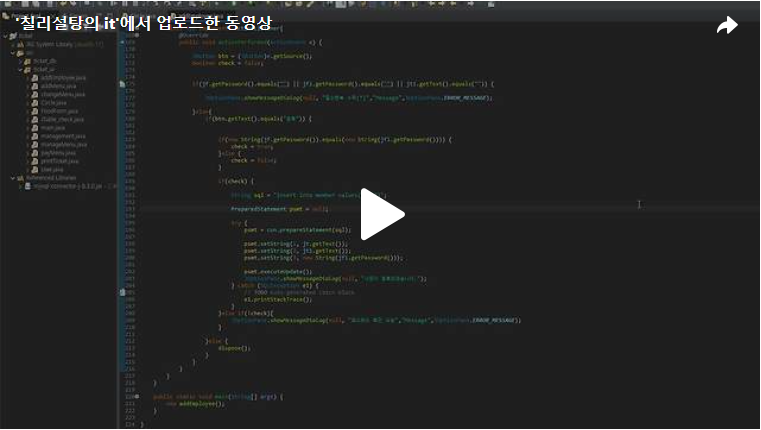

안녕하세요. 이번 프로젝트의 마지막을 달리는 것 같습니다.<br>
오늘은 이번 프로젝트의 마지막 조건에 대해서 해결해보도록 하겠습니다.<br>


<br>
<br>조건 1)<br>
[사원등록] 폼의 사원번호는 자동으로 기존 마지막 사원번호+1이 적용되어 입력되고, 직접 입력할 수 없도록 제어하시오.
마지막 사원번호에서 1이 추가되어서 사원번호가 나오고 직접입력할수 없기에 sql문을 통해 member데이터베이스안의 memberNo행의 최고 숫자를 뽑아내는 select max(memberNo) from member을 통해 뽑아내고 setEnalbed(false)를 통해 비활성화 시키겠습니다.<br>

<br>
<br>
<br>

<br>
위와 같은 코드를 실행하면 아래의 결과와 같이 결과값이 나오게 됩니다.<br>

<br>

<br>조건2)<br>
‘패스워드’, ‘패스워드 재입력’에 입력한 문자열을 '●'로 표시하고, 숫자가 아닌 문자를 입력하거나 4글자를 초과하여 입력 시 내용이 즉각 지워지도록 처리하시오.<br>
‘패스워드’, ‘패스워드 재입력’에 입력한 문자열을 '●'로 표시하기 위해 위의 사원등록 폼을 생성할때 JPasswordField를 통해 생성하였습니다. 또한 숫자가 아닌 문자를 입력하거나 4글자를 초과할 경우 입력내용이 즉각 지워지도록 하는 부분은 정규 표현식을 통해서 조건을 만족시키도록 하겠습니다.<br>
<br>
오직 숫자만 입력이 되야하고 4글자를 초과할수 없기에 다음과 같은 정규식을 작성했습니다.<br>

public static final String REGEXP_PATTERN_NUMBER = "^[0-9]{0,4}$";<br>
^: 문자열의 시작을 의미합니다. <br>
[0-9]: 숫자(0-9) 중 하나를 의미합니다. <br>
{0,4}: 앞에 나온 [0-9]가 0번에서 4번까지 반복될 수 있음을 의미합니다. <br>
$: 문자열의 끝을 의미합니다.<br>
<br>
정규 표현식을 통해 JPasswordField에 작성한 텍스트가 정규표현식에 일치하면 true를 반환 일치하지 않으면 false를 반환시켜 만일 false이면 텍스트를 지우도록 하였습니다.<br>
<br>

<br>조건 3)<br>
‘패스워드’와 ‘패스워드 재입력’에 패스워드를 입력하고 Tab키를 눌러 다른 컴포넌트로 커서 이동 시 서로 일치하지 않을 경우 [그림 2-35]와 같이 ‘불일치’ 텍스트가 빨간색으로 나타나게 하고, 서로 일치하는 경우 [그림 2-36]과 같이 ‘일치’ 텍스트가 파란색으로 나타나게 하시오.<br>
조건 3)은 조건 2)를 이용하여 ‘패스워드 재입력’ 부분도 정규표현식을 통해 조건2)를 확인하고 ‘패스워드’와 ‘패스워드 재입력’의 텍스트가 같은지 아닌지 확인했습니다.<br>

<br>


<br>조건 4) / 조건 5) / 조건 6) / 조건 7)<br>
조건 4: 필수 항목을 입력하지 않고 [등록] 버튼 클릭 시 [그림 2-37]의 메시지가 출력되도록 하시오.<br>
조건 5: ‘패스워드’와 ‘패스워드 재입력’이 서로 일치하지 않은 상태에서 [등록] 버튼 클릭 시 [그림 2-38]의 메시지가 출력되도록 하시오.<br>
조건 6: 조건 3), 4)를 위배하지 않고 [등록] 버튼을 클릭하면 [그림 2-39]의 메시지가 출력되고 DB에 데이터가 저장되도록 하시오. 또한 등록된 사원번호와 패스워드로 식권 결제가 가능하도록 하시오.<br>
조건 7: [닫기] 버튼을 클릭하면 폼이 종료되도록 하시오.<br>

<br>

이렇게 프로젝트의 마지막 조건을 만들어보았습니다.<br>
다음에는 마지막 최종본으로 돌어오겠습니다!!<br>

[](https://tv.kakao.com/v/449830770)<br>


```java
package ticket_ui;

import java.awt.BorderLayout;
import java.awt.Color;
import java.awt.Container;
import java.awt.FlowLayout;
import java.awt.GridLayout;
import java.awt.event.ActionEvent;
import java.awt.event.ActionListener;
import java.awt.event.KeyAdapter;
import java.awt.event.KeyEvent;
import java.sql.Connection;
import java.sql.PreparedStatement;
import java.sql.ResultSet;
import java.sql.SQLException;
import java.sql.Statement;
import java.util.regex.Pattern;

import javax.swing.JButton;
import javax.swing.JFrame;
import javax.swing.JLabel;
import javax.swing.JOptionPane;
import javax.swing.JPanel;
import javax.swing.JPasswordField;
import javax.swing.JTextField;


import ticket_db.Driver_connect;

public class addEmployee extends JFrame{
	JTextField jt, jt1;
	JPasswordField jf, jf1;
	Connection con = Driver_connect.makeConnection("ticket");

	
	public addEmployee() {
		setTitle("사원등록");
		Container c = getContentPane();
		
		setLayout(new BorderLayout());
		add(new center(), BorderLayout.CENTER);
		add(new Bottom(), BorderLayout.SOUTH);
		
		
		c.setFocusable(true);
		c.requestFocus();
		
		setVisible(true);
		setSize(300,300);
		
	}
	
	class center extends JPanel{
		String num;
		
		JLabel passwordLabel = new JLabel("1234");
		String s[] = {"  사원번호","  *사원명","  *패스워드","*패스워드 재입력"," "};
		JLabel la[] = new JLabel[s.length];
		char[] k ;
		String str;
		public center() {
			
			String findMaxMemberNo = "select max(memberNo) from member";
			
			try {
				Statement st = con.createStatement();
				ResultSet rs = st.executeQuery(findMaxMemberNo);
				
				while(rs.next()) {
					num = Integer.toString(Integer.parseInt(rs.getString(1))+1);
				}
			}catch (SQLException e1) {
				// TODO Auto-generated catch block
				e1.printStackTrace();
			}
			
			jt = new JTextField(10);
			jf = new JPasswordField(10);
			jf1 = new JPasswordField(10);
			jt1 = new JTextField(10);
			
			setLayout(new GridLayout(4,2));
			
			for(int i = 0; i<s.length; i++) {
				la[i] = new JLabel(s[i]);
			}
			
			JPanel jp = new JPanel();
			jp.setLayout(new FlowLayout(FlowLayout.LEFT));
			jp.add(la[3]);
			jp.add(la[4]);
			
			add(la[0]); add(jt);
			add(la[1]); add(jt1);
			add(la[2]); 
			
			jf1.addKeyListener(new My1());
			
			add(jf);
			add(jp); 
			add(jf1);
			
			k = jf.getPassword();
			jt.setText(num);
			jt.setEnabled(false);
			
			jf.addKeyListener(new My());
			jf1.addKeyListener(new My1());
			
		}
		public static final String REGEXP_PATTERN_NUMBER = "^[0-9]{0,4}$";
		
		class My extends KeyAdapter{
			@Override
			public void keyReleased(KeyEvent e) {

				char[] s = jf.getPassword();
				str = String.valueOf(s); 
				Boolean isCheckNumber1 = Pattern.matches(REGEXP_PATTERN_NUMBER, str); 
				
				if(! isCheckNumber1) {
					jf.setText("");
				}
				 
			}
		}
		
		class My1 extends KeyAdapter{
			@Override
			public void keyReleased(KeyEvent e) {
				
				char[] s1 = jf1.getPassword();
				String str1 = String.valueOf(s1); 
				
				Boolean isCheckNumber2 = Pattern.matches(REGEXP_PATTERN_NUMBER, str1); 
				
				if(! isCheckNumber2) {
					jf1.setText("");
				}else if(str1.equals(str)){
					la[4].setForeground(Color.blue);
					la[4].setText("일치");
				}else {
					la[4].setForeground(Color.red);
					la[4].setText("불일치");
				}
				
				
			}
		}
	}
	
	class Bottom extends JPanel{
		public Bottom() {
			setLayout(new GridLayout(1,2));
			String []k = {"등록", "닫기"};
			JButton btn[] = new JButton[k.length];
			
			for(int i = 0; i<btn.length; i++) {
				btn[i] = new JButton(k[i]);
				add(btn[i]);
				btn[i].addActionListener(new My2());
			}
			
		}
		
		class My2 implements ActionListener{
			@Override
			public void actionPerformed(ActionEvent e) {
				
				JButton btn = (JButton)e.getSource();
				boolean check = false;
				
				
				if(jf.getPassword().equals("") || jf1.getPassword().equals("") || jt1.getText().equals("")) {
					
					JOptionPane.showMessageDialog(null, "필수항복 누락(*)","Message",JOptionPane.ERROR_MESSAGE);
					
				}else{
					if(btn.getText().equals("등록")) {
				
					
						if(new String(jf.getPassword()).equals(new String(jf1.getPassword()))) {
							check = true;
						}else {
							check = false;
						}
					
						if(check) {
						
							String sql = "insert into member values(?,?,?)";
						
							PreparedStatement psmt = null;
						
							try {
								psmt = con.prepareStatement(sql);
							
								psmt.setString(1, jt.getText());
								psmt.setString(2, jt1.getText());
								psmt.setString(3, new String(jf1.getPassword()));
							
								psmt.executeUpdate();
								JOptionPane.showMessageDialog(null, "사원이 등록되었습니다.");
							} catch (SQLException e1) {
								// TODO Auto-generated catch block
								e1.printStackTrace();
							}
						}else if(!check){
							JOptionPane.showMessageDialog(null, "패스워드 확인 요망","Message",JOptionPane.ERROR_MESSAGE);
						}
					
					}else {
						dispose();
					}
				}
			}
		}
	}

	public static void main(String[] args) {
		new addEmployee();
	}

}


 
