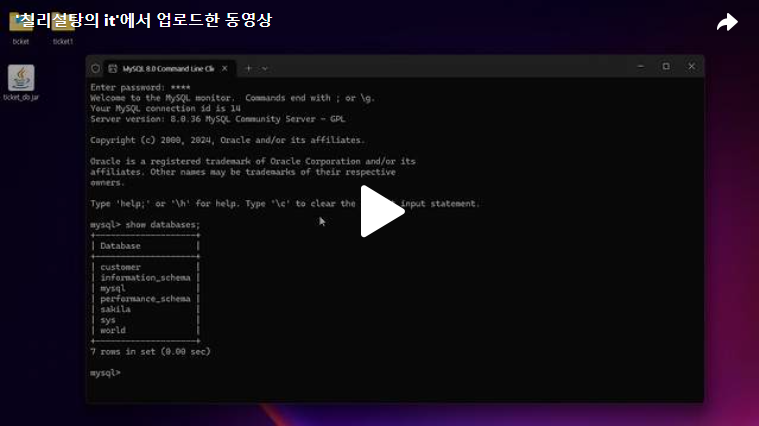
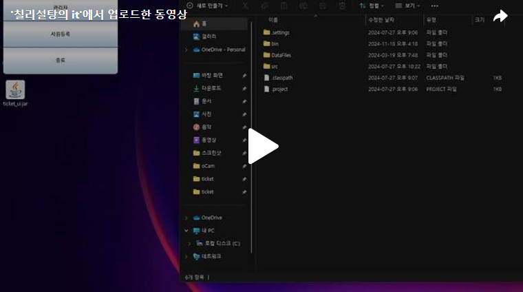
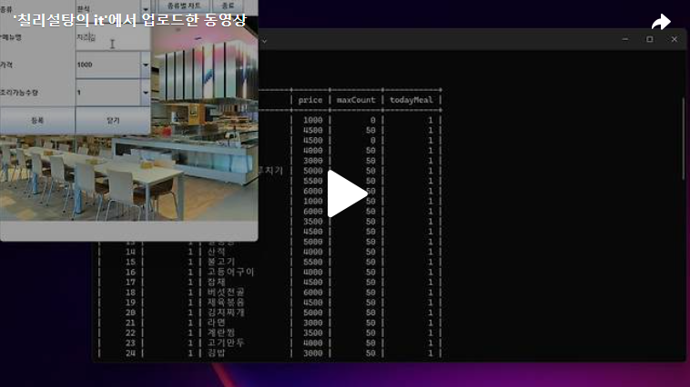

안녕하세요. Day1부터 Day13까지 만든 코드들을 합쳐 최종jar로 만드는 작업을 진행해보도록 하겠습니다. 
Eclipse를 통해 jar파일을 만드는 방법은 아래와 같이 첨부하겠습니다.==>

[블로그 바로가기](https://chillysugar-study.tistory.com/17) 

 
1. 데이터베이스 

 

 

2. 사용자_UI 

 

 

3. 관리자_UI 

 

이렇게 이번 프로젝트를 완성했습니다.  
봐주셔서 감사합니다!! 

