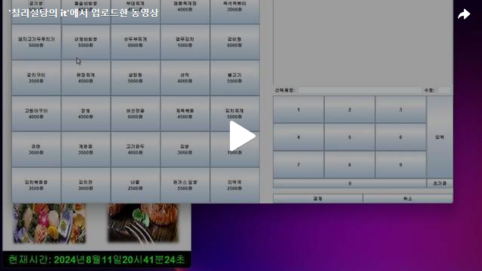

안녕하세요. 오늘은 Day4에 이어 결제 폼을 이어서 만들어보도록 하겠습니다.<br>
오늘 만들 부분은 아래와 같습니다.<br>


우선 제일 처음 이것을 봤을때 어떻게 만들어야 하나 고민을 많이 했습니다.<br>
상단의 그림을 2가지 부분으로 나누어 생각해보겠습니다.<br>

그림(1)<br>


<br>
그림(2)<br>


그림(1)에 대해 아래의 그림과 같이 그림(3)과 그림(4)로 소분해서 생각해보겠습니다.<br>
<br>
그림(3)<br>


<br>
그림(4)<br>


그림(3)을 만들어보겠습니다.<br>


<br>
그림(4)을 만들어보겠습니다.<br>


<br>
그림(2)에 대해 아래의 그림과 같이 소분해서 만들어보겠습니다.<br>

<br>
<br>
<br>
그림(5)을 만들어보겠습니다.<br>

<br>
<br>
<br>
그림(6)을 만들어보겠습니다.<br>


<br>

[](https://tv.kakao.com/v/448757182)<br>

```java
package ticket_ui;


import java.awt.BorderLayout;
import java.awt.Container;
import java.awt.Dimension;
import java.awt.Font;
import java.awt.GridLayout;
import java.awt.event.ActionEvent;
import java.awt.event.ActionListener;
import java.awt.event.MouseAdapter;
import java.awt.event.MouseEvent;
import java.sql.Connection;
import java.sql.PreparedStatement;
import java.sql.ResultSet;
import java.sql.SQLException;
import java.sql.Statement;
import java.text.DecimalFormat;
import java.util.Calendar;
import java.util.Vector;
import javax.swing.JButton;
import javax.swing.JComboBox;
import javax.swing.JFrame;
import javax.swing.JLabel;
import javax.swing.JOptionPane;
import javax.swing.JPanel;
import javax.swing.JPasswordField;
import javax.swing.JScrollPane;
import javax.swing.JTable;
import javax.swing.JTextField;
import javax.swing.border.Border;
import javax.swing.table.DefaultTableModel;
import ticket_db.Driver_connect;
import ticket_ui.FoodForm.Left.menuButton;

public class FoodForm extends JFrame{

	int num = 0;
	Vector<menuButton> mbn = new Vector<menuButton>();
	String typeFood[] = {"한식","중식","일식","양식"};
	Vector<String> a = null;
	String JTableName[] = {"상품번호","품명","수량","금액"};
	JTextField jt1;
	JTextField jt2;
	Vector<String> allinfo = new Vector<String>();
	JTable jtable;
	String totalMoney = "0";
	JLabel la;
	JLabel la2;
	Vector<Vector<String>> rowData;
	JComboBox<String> jc;
	JPasswordField passwordJt;
	JLabel jl;
	DefaultTableModel model;

	
	//number에 따른 하닉,일식,양식, 중식의 결제창 생성하기위해 사진을 눌렀을때 생성한number를 매개변수로 사용
	public FoodForm(int number) {
		this.num = number;
		setTitle("결제");
		setDefaultCloseOperation(JFrame.EXIT_ON_CLOSE);
		Container c = getContentPane();
		
		c.add(new Top(),BorderLayout.NORTH);
		c.add(new Left(),BorderLayout.WEST);
		c.add(new Right(),BorderLayout.EAST);
		
		setSize(1200,650);
		setVisible(true);
	}

	//상단의 메뉴종류에 대한 label
	class Top extends JPanel{

		public Top() {

			setLayout(new BorderLayout());

			jl = new JLabel(typeFood[num-1]);
			jl.setFont(new Font("",Font.BOLD,25));
			jl.setHorizontalAlignment(JLabel.CENTER);
			add(jl,BorderLayout.CENTER);

			add(new Top_East(), BorderLayout.EAST);
		}

	}

	class Top_East extends JPanel{

		public Top_East() {
			
			setLayout(new GridLayout(1,2));


			la = new JLabel("총 결제금액: ");

			la.setFont(new Font("돋움",Font.BOLD,20));
			la.setHorizontalAlignment(JLabel.LEFT);
			add(la); ;
			
			la2 = new JLabel(totalMoney+"원");
			la2.setFont(new Font("돋움",Font.BOLD,20));
			la2.setHorizontalAlignment(JLabel.RIGHT);
			add(la2);
			

		}

	}

	class Left extends JPanel{

		//매개변수로 받은 num을 통해 sql뮨을 통해 데이터베이스에 저장된 메뉴 정보를 가져오기
		String mealNameSql = "select mealName, price, maxCount, todayMeal,mealNo from meal where cuisineNo =" +num;
		String avableMeal = "select mealName from meal where (todayMeal = 0 or maxCount = 0) and cuisineNo ="+num;

		Connection conn = Driver_connect.makeConnection("ticket");
		Statement stmt;

		public Left() {

			int rowCount;
			int maxMenu = 0;

			try {

				stmt = conn.createStatement();
				ResultSet rs = stmt.executeQuery(mealNameSql);

				//정보가 없을때 까지 mealNamesql에 대한 결과값을 벡터에 저장
				while(rs.next()) {
					a = new Vector<String>();
					for(int i =1; i<=5; i++) {
						a.add(rs.getString(i));
					}
					maxMenu++;
					//하나의 메뉴에 대한 정보가 들어있는 벡터를 menuButton클래스 삽입 후 메뉴에 대한 버튼 생성
					mbn.add(new menuButton(a));
				}

				rs.close();
        
				//메뉴 개수에 따라 행과열 설정
				if(maxMenu%5 == 0) {
					rowCount = maxMenu/5;	
				}else {
					rowCount = maxMenu/5+1;
				}
				setLayout(new GridLayout(rowCount,5));
			} catch (SQLException e) {
				// TODO Auto-generated catch block
				e.printStackTrace();
			}

			for(int i = 0; i<mbn.size(); i++) {
				add(mbn.get(i));
			}
		}


		class addMenu implements ActionListener{
			@Override
			public void actionPerformed(ActionEvent e) {
				menuButton menuName = (menuButton)e.getSource();
				jt1.setText(menuName.menu);
			}

		}

		
		//각 메뉴에 대한 메뉴버튼 클래스 생성
		class menuButton extends JButton{

			String menu = "";
			String price = "";
			String maxCount = "";
			String todayMeal = "";
			String mealNo = "";

			public menuButton(Vector<String> a) {

				menu = a.get(0);
				price = a.get(1);
				maxCount = a.get(2);
				todayMeal = a.get(3);
				mealNo = a.get(4);

				this.setText("<HTML><center>"+menu+"<br>"+price+"원</center> </HTML>");
				this.addActionListener(new addMenu());

			}

			public String getMenu() {
				return this.menu;
			}

			public String getPrice() {
				return this.price;
			}

			public String getmealNO() {
				return this.mealNo;
			}
			public String getmaxCount() {
				return this.maxCount;
			}
		}

	}

	class Right extends JPanel{

		public Right() {

			setLayout(new GridLayout(2,1));

			add(new Right_Top());
			add(new Right_Bottom());

			}
		}

	class Right_Top extends JPanel{

		public Right_Top() {

			setLayout(new BorderLayout());

			add(new Top_Center(),BorderLayout.CENTER);

			add(new Top_South(), BorderLayout.SOUTH);

		}

	}


	//Jtable 생성
	class Top_Center extends JPanel{

		JScrollPane jps;
		
		public Top_Center() {

			setLayout(new BorderLayout());
			rowData = new Vector<Vector<String>>();
			Vector<String> colData = new Vector<String>();

			//JTable_Name의 길이만큼 행추가

			for(int i = 0; i<JTableName.length;i++) {
				colData.add(JTableName[i]);
			}

			jtable = new JTable(rowData,colData);
			JScrollPane jps = new JScrollPane(jtable);
			add(jps, BorderLayout.NORTH);
		}

	}
	class Top_South extends JPanel{

		public Top_South() {
			JLabel selectedFood = new JLabel("선택품명: ");
			
			jt1 = new JTextField(30);
			jt1.setEnabled(false);
			JLabel count = new JLabel("수량: ");
			jt2 = new JTextField(3);
			jt2.setEnabled(false);
			
			add(selectedFood); add(jt1);
			add(count); add(jt2);
		}

	}

	//숫자버튼과 결제버튼
	class Right_Bottom extends JPanel{

		public Right_Bottom() {
			setLayout(new BorderLayout(15,15));
			add(new Bottom_Center(), BorderLayout.CENTER);
			add(new chargeButton(),BorderLayout.SOUTH);
		}
	}

	//숫자버튼, 입력,초기화버튼
	class Bottom_Center extends JPanel{
		public Bottom_Center() {
			setLayout(new BorderLayout());

			add(new AllnumberButton(),BorderLayout.CENTER);
			add(new input_reset_Button(), BorderLayout.EAST);

		}
	}
	
	//숫자버튼안에 1~9번 버튼과 0번버튼
	class AllnumberButton extends JPanel{
		public AllnumberButton() {

			setLayout(new BorderLayout());
			JButton zerobtn = new JButton("0");
			zerobtn.addActionListener(new menuCount());
			add(new numberButton(),BorderLayout.CENTER);
			add(zerobtn,BorderLayout.SOUTH);
		}
	}

	//1~9번버튼
	class numberButton extends JPanel{

		public numberButton() {
			JButton btn[] = new JButton[10];
			setLayout(new GridLayout(3,3));
			
			for(int i = 1; i<10; i++) {
				btn[i-1] = new JButton(Integer.toString(i));
				add(btn[i-1]);
				btn[i-1].addActionListener(new menuCount());
			}
		}
	}

	class menuCount implements ActionListener{
		@Override
		public void actionPerformed(ActionEvent e) {
			JButton btn = (JButton)e.getSource();
		
			String menuCount = jt2.getText();
			jt2.setText(menuCount + btn.getText());
		}

	}

	//숫자버튼 안에 입력과 초기화버튼
	class input_reset_Button extends JPanel{

		public input_reset_Button() {

			setLayout(new BorderLayout());
			String s[] = {"입력","초기화"};
			JButton btn[] = new JButton[s.length];

			for(int i = 0; i<btn.length; i++) {

				btn[i] = new JButton(s[i]);
			}
			add(btn[0],BorderLayout.CENTER);
			add(btn[1],BorderLayout.SOUTH);
		}
	}
	

	//결제버튼
	class chargeButton extends JPanel{

		public chargeButton() {
			setLayout(new GridLayout(1,2));
			String s[] = {"결제","취소"};
			JButton btn[] = new JButton[2];
			for(int i = 0; i< btn.length; i++) {
				btn[i] = new JButton(s[i]);
				add(btn[i]);		

			}
		}
	}
	

}

