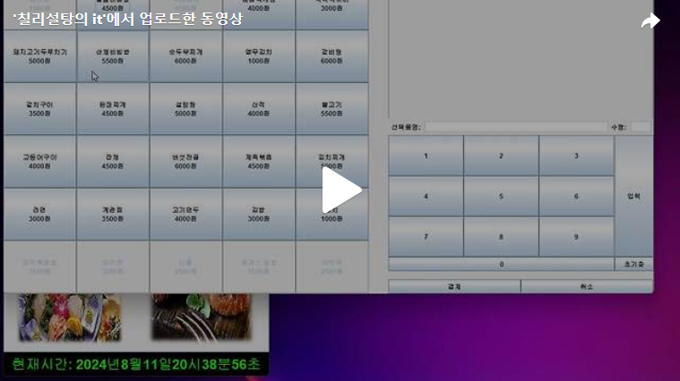

안녕하세요. Day4, Day5에 걸쳐 결제 폼을 만들었습니다. 
이제 결제 폼에 필요한 ActionListener을 생성해보도록 하겠습니다. 
전체 필요한 조건은 18개입니다.  
저희가 오늘 추가해야 할 Action(7개)에 대해 알아보겠습니다. 

 

오늘은 1~7번의 조건에 맞춰 Action을 생성하겠습니다. 

 조건1) 
[식권 발매 프로그램] 폼의 [한식], [중식], [일식], [양식] 버튼을 눌렀을 때 해당 종류에 맞는 상단 제목과 메뉴 버튼이 나타나도록 하시오.==> 이부분은 생성자를 통해 미리 조건을 부합하게 만들었기에 다음으로 넘어가겠습니다. 
 
메뉴 버튼은 ‘조리가능수량’이 1 이상이고, ‘오늘의 메뉴’가 1일 때 누를 수 있도록 하고, 그 외에는 비활성화 되거나 보이지 않게 하시오. ==> Mysql구문을 통해 조리가능수량’이 1 이상이고, ‘오늘의 메뉴’가 1인 메뉴를 알아낸 후 Enalble 시키겠습니다.(구문에서 num변수는 일식, 양식, 중식, 한식을 나타내는 String변수입니다.) 

 
 조건2) 
메뉴 버튼은 ‘메뉴명’, ‘가격’이 나타나도록 하시오. ==> 결제 폼을 만들때 이미 설정했기에 넘어가겠습니다. 
 
 조건3) 
폼 우측의 번호가 표시된 버튼은 ‘수량’을 입력할 때 사용되며, 버튼 클릭 시 ‘수량’ 텍스트란에 값이 입력되도록 하시오. 단, 세 글자 이상 입력되지 않게 하시오. 

 
 조건4) 
폼 우측의 [초기화] 버튼을 누르면 ‘수량’ 텍스트란의 값이 초기화되도록 하시오. 

 조건 5) / 조건 7) 

폼 우측의 ‘선택품명’ 텍스트란의 값이 비어있는 상태에서 [입력] 버튼을 클릭 시 [그림 2-6]의 메시지가 나타나도록 하시오. / 폼 우측의 ‘선택품명’ 텍스트란에 값이 존재하되, ‘수량’ 텍스트란에 값이 비어있는 상태에서 [입력] 버튼 클릭 시 [그림 2-7]의 메시지가 나타나도록 하시오. 

 조건 6) 
폼 좌측의 메뉴 버튼을 클릭하면 ‘선택품명’ 텍스트란에 해당 버튼의 메뉴명이 입력되도록 하시오. 

 

[]https://tv.kakao.com/v/448757098) 

 오늘은 이렇게 우선 조건7개에 대해 적용했습니다. 나머지 부분은 이어서 다음에 해보도록 하겠습니다.
