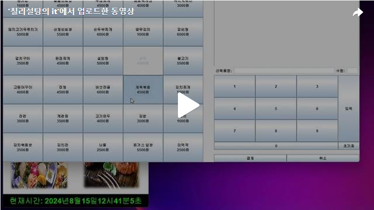

안녕하세요. 오늘은 Day6에 이어 결제폼에 Action을 만들어 보겠습니다. 
아래의 그림과 같이 8 ~ 11번의 Action을 생성하겠습니다. 

 
 
 

 조건 8) / 조건 9) 
조건8: 폼 우측의 ‘선택품명’ 텍스트란에 값이 존재한 상태에서 ‘수량’을 입력하고 [입력] 버튼 클릭 시, 해당 ‘선택품명’의 ‘조리가능수량’의 값보다 ‘수량’의 값이 클 경우 [그림 2-8]의 메시지가 나타나도록 하시오. 또한 ‘수량’을 10 초과하여 입력할 수 없도록 하시오.  
 
조건9: [그림 2-9]와 같이 폼에서 메뉴와 결제 수량을 입력한 후 [입력] 버튼을 클릭하면 [그림 2-10]과 같이 폼 오른쪽 상단 테이블에 해당 메뉴의 ‘메뉴번호’, ‘메뉴명’, ‘수량’, ‘총금액(수량*금액)’이 표시되고, 테이블 상단의 ‘총결제금액’은 테이블에 들어있는 모든 금액의 총합계가 나타나도록 하시오. 이 테이블은 직접 수정할 수 없도록 하시오. 또한, 기존에 테이블에 담긴 메뉴는 다시 선택할 수 없도록 메뉴 버튼을 비활성화 처리하시오. 
==> 오른쪽 상단 테이블에 올라간 메뉴명을 Vector에 저장을 한 후 menuButton과 Vector을 비교하여 일치하는 것이 있으면 menuButton을 비활성화 시키겠습니다.

 

 조건 10) 
테이블에 등록된 메뉴 레코드를 더블 클릭하면 해당 메뉴가 테이블에서 삭제되고, 다시 해당 메뉴 버튼이 활성화되도록 하시오. 또한 ‘총결제금액’이 재계산되도록 하시오. 
==> mouseAdapter을 사용하여 click이 2번 됬을때 DefaultTableModel을 생성하여 Action을 걸도록 하겠습니다. 

 
 
 조건 11) 
폼에서 구매할 메뉴와 수량을 입력한 뒤 [결제] 버튼을 클릭하면 [그림 2-11]와 같이 [결제자 인증] 폼이 실행되도록 하시오. ‘사원번호’는 콤보 박스 형태로 DB에 저장된 사원번호를 선택할 수 있도록 하며, 해당 ‘사원번호’의 ‘패스워드’를 텍스트란에 입력하고 [확인] 버튼을 클릭하면 [결제] 폼에서 선택한 메뉴가 ‘결제목록’ 테이블에 등록되도록 하시오. 또한, 선택 메뉴의 ‘조리가능수량’은 입력한 수량만큼 차감되도록 하시오. 만약 ‘사원번호’에 대한 패스워드를 정확히 입력하지 않았을 경우 [그림 2-12]의 메시지가 나타나고, 더 이상 결제가 진행되지 않도록 하시오. 
==> 먼저 [그림 2-11]을 JPanel을 통해 생성하도록 하겠습니다. 

 
 
==> Mysql과 연동하여 사원번호와 패스워드가 일치하면 Mysql의 orderlist테이블에 결제 정보가 들어가도록 하겠습니다. 

 
 
 
 
오늘은 결제폼의 Action 8 ~ 11번 까지 만들어보았습니다. 아래의 영상은 오늘 작성한 부분에 대한 영상입니다!!
 
