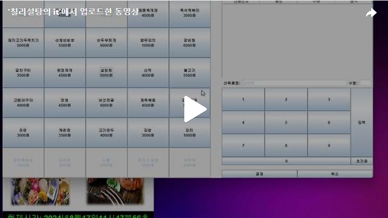

안녕하세요. 오늘은 결제폼에 Action을 생성하는 마지막 단계입니다.<br>
오늘 만들어야 할 Action에 대해 설명하도록 하겠습니다.<br>
오늘은 아래의 그림과 같이  총 7개의 Action을 생성하도록 하겠습니다.<br>

<br>
<br>

<br>조건 12)<br>
[결제자 인증] 폼에서 결제가 정상적으로 이루어졌다면 [그림 2-13]의 메시지가 나타나게 하고, [확인] 버튼을 누르면 [결제] 폼이 닫히고 [그림 2-14]와 같이 [식권] 폼이 실행되게 하시오.<br>
==> Day7에서 결제가 완료되었을때 메세지가 나타나게 했으니 넘어가고 [식권]폼을 만들도록 하겠습니다.<br>
<br>
<br>조건13) / 조건 14) / 조건 15) / 조건16)<br>

조건 13: [그림 2-14] [식권] 폼의 식권의 배경색은 메뉴 별로 ‘바다색’, ‘분홍색’이 번갈아 나타나며, [결제] 폼에서 결제한 메뉴와 가격이 출력되도록 하시오.<br>
==> Boolean 변수를 활용하여 변수가 True이면 바다색, False이면 분홍색이 나오도록 하겠습니다.<br>
<br>
조건 14: [식권] 폼 좌측 상단의 ‘일련번호’는 ‘식권을 발행한 년, 월, 일, 시, 분, 초’와 결제자의 ‘사원번호’, 마지막으로 ‘종류번호’를 하이픈 ‘-’ 기호로 연결하여 표시한다.<br>
==>  Day7에서 주문한 목록을 orderlist의 데이터베이스에 삽입할때 주문시각을 Calendar클래스를 통해 미리 받아놨습니다. 따라서 orderlist 데이터베이스에 데이터를 삽입할때 사용한 Calendar클래스와 사원번호를 합친 일렬번호를 매개변수로 설정해 식권클래스를 만들도록 하겠습니다.<br>

<br>
<br>

조건 15: [식권] 폼 중앙 하단의 가격은 단위 기호와 ‘원’ 글자를 포함하여 표시한다.<br>
==> DecimalFormat을 사용하여 표시하겠습니다.<br>
<br>
조건 16: [식권] 폼 우측 하단의 숫자는 해당 결제 메뉴의 ‘현재 번호 / 전체 수량’를 표시한다.<br>
==> 매개변수로 받은 rowData를 통해 표시하겠습니다.<br>
<br>
<br>
<br>
<br>

<br>조건 17)<br>
[식권] 폼에 발행한 식권이 두 장 이상일 경우 우측 스크롤바를 생성하여 나머지 항목을 볼 수 있도록 한다.<br>
==> JScrollPane을 통해 표시하겠습니다.<br>

<br>

<br>조건 18)<br>
[식권] 폼이 실행됨과 동시에 MealProject.jar 파일이 실행된 경로에 [그림 2-15]와 같이 식권이 이미지 파일로 생성되게 한다. 파일명은 [식권] 폼 좌측 상단 일련번호-ticket.jpg 라는 이름으로 생성한다.<br>
==> 이미지를 저장하는 함수를 만들어 이미지파일 경로에 이미지를 저장하도록 하겠습니다, save()함수를 생성후 생성자에서 save()함수를 호출 하겠습니다.<br>

<br>

이렇게 결제폼에 필요한 모든 Action을 만들었습니다. <br>
감사합니다!!<br>

[](https://tv.kakao.com/v/448880108)<br>


아래는 FoodForm에 관한 코드입니다!<br>
```java
package ticket_ui;


import java.awt.BorderLayout;
import java.awt.Container;
import java.awt.Dimension;
import java.awt.Font;
import java.awt.GridLayout;
import java.awt.event.ActionEvent;
import java.awt.event.ActionListener;
import java.awt.event.MouseAdapter;
import java.awt.event.MouseEvent;
import java.sql.Connection;
import java.sql.PreparedStatement;
import java.sql.ResultSet;
import java.sql.SQLException;
import java.sql.Statement;
import java.text.DecimalFormat;
import java.util.Calendar;
import java.util.Vector;
import javax.swing.JButton;
import javax.swing.JComboBox;
import javax.swing.JFrame;
import javax.swing.JLabel;
import javax.swing.JOptionPane;
import javax.swing.JPanel;
import javax.swing.JPasswordField;
import javax.swing.JScrollPane;
import javax.swing.JTable;
import javax.swing.JTextField;
import javax.swing.border.Border;
import javax.swing.table.DefaultTableModel;
import ticket_db.Driver_connect;
import ticket_ui.FoodForm.Left.menuButton;

public class FoodForm extends JFrame{

	int num = 0;
	Vector<menuButton> mbn = new Vector<menuButton>();
	String typeFood[] = {"한식","중식","일식","양식"};
	Vector<String> a = null;
	String JTableName[] = {"상품번호","품명","수량","금액"};
	JTextField jt1;
	JTextField jt2;
	Vector<String> allinfo = new Vector<String>();
	JTable jtable;
	String totalMoney = "0";
	JLabel la;
	JLabel la2;
	Vector<Vector<String>> rowData;
	DecimalFormat df = new DecimalFormat("###,###");
	JComboBox<String> jc;
	JPasswordField passwordJt;
	JLabel jl;
	DefaultTableModel model;

	
	//number에 따른 하닉,일식,양식, 중식의 결제창 생성하기위해 사진을 눌렀을때 생성한number를 매개변수로 사용
	public FoodForm(int number) {
		this.num = number;
		setTitle("결제");
		setDefaultCloseOperation(JFrame.EXIT_ON_CLOSE);
		Container c = getContentPane();
		
		c.add(new Top(),BorderLayout.NORTH);
		c.add(new Left(),BorderLayout.WEST);
		c.add(new Right(),BorderLayout.EAST);
		
		setSize(1200,650);
		setVisible(true);
	}

	//상단의 메뉴종류에 대한 label
	class Top extends JPanel{

		public Top() {

			setLayout(new BorderLayout());

			jl = new JLabel(typeFood[num-1]);
			jl.setFont(new Font("",Font.BOLD,25));
			jl.setHorizontalAlignment(JLabel.CENTER);
			add(jl,BorderLayout.CENTER);

			add(new Top_East(), BorderLayout.EAST);
		}

	}

	class Top_East extends JPanel{

		public Top_East() {
			
			setLayout(new GridLayout(1,2));


			la = new JLabel("총 결제금액: ");

			la.setFont(new Font("돋움",Font.BOLD,20));
			la.setHorizontalAlignment(JLabel.LEFT);
			add(la); ;
			
			la2 = new JLabel(totalMoney+"원");
			la2.setFont(new Font("돋움",Font.BOLD,20));
			la2.setHorizontalAlignment(JLabel.RIGHT);
			add(la2);
			

		}

	}

	class Left extends JPanel{

		//매개변수로 받은 num을 통해 sql뮨을 통해 데이터베이스에 저장된 메뉴 정보를 가져오기
		String mealNameSql = "select mealName, price, maxCount, todayMeal,mealNo from meal where cuisineNo =" +num;

		Connection conn = Driver_connect.makeConnection("ticket");
		Statement stmt;

		public Left() {
			int rowCount;
			int maxMenu = 0;

			try {

				stmt = conn.createStatement();
				ResultSet rs = stmt.executeQuery(mealNameSql);

				//정보가 없을때 까지 mealNamesql에 대한 결과값을 벡터에 저장
				while(rs.next()) {
					a = new Vector<String>();
					for(int i =1; i<=5; i++) {
						a.add(rs.getString(i));
					}
					maxMenu++;
					//하나의 메뉴에 대한 정보가 들어있는 벡터를 menuButton클래스 삽입 후 메뉴에 대한 버튼 생성
					mbn.add(new menuButton(a));
				}

				rs.close();
				
				String avableMeal = "select mealName from meal where (todayMeal = 0 or maxCount = 0) and cuisineNo ="+num;
				ResultSet rs1 = stmt.executeQuery(avableMeal);
				
				//오늘의 메뉴가 아니거나 조리가능 숫자가 0인 메뉴에 대해 버튼을 비활성화 
				while(rs1.next()) {
					int i = 1;
					String notavailableMealName = rs1.getString(i);//rs1.getString(1)은 mealName
					for (menuButton button : mbn) {
	                    if (notavailableMealName.equals(button.menu)) {
	                        button.setEnabled(false);
	                    }
	                }

				}
				
				//메뉴 개수에 따라 행과열 설정
				if(maxMenu%5 == 0) {
					rowCount = maxMenu/5;	
				}else {
					rowCount = maxMenu/5+1;
				}
				setLayout(new GridLayout(rowCount,5));
			} catch (SQLException e) {
				// TODO Auto-generated catch block
				e.printStackTrace();
			}

			for(int i = 0; i<mbn.size(); i++) {
				add(mbn.get(i));
			}
		}


		class addMenu implements ActionListener{
			@Override
			public void actionPerformed(ActionEvent e) {
				menuButton menuName = (menuButton)e.getSource();
				jt1.setText(menuName.menu);
			}

		}

		
		//각 메뉴에 대한 메뉴버튼 클래스 생성
		class menuButton extends JButton{

			String menu = "";
			String price = "";
			String maxCount = "";
			String todayMeal = "";
			String mealNo = "";

			public menuButton(Vector<String> a) {

				menu = a.get(0);
				price = a.get(1);
				maxCount = a.get(2);
				todayMeal = a.get(3);
				mealNo = a.get(4);

				this.setText("<HTML><center>"+menu+"<br>"+price+"원</center> </HTML>");
				this.addActionListener(new addMenu());

			}

			public String getMenu() {
				return this.menu;
			}

			public String getPrice() {
				return this.price;
			}

			public String getmealNO() {
				return this.mealNo;
			}
			public String getmaxCount() {
				return this.maxCount;
			}
		}

	}

	class Right extends JPanel{

		public Right() {

			setLayout(new GridLayout(2,1));

			add(new Right_Top());
			add(new Right_Bottom());

			}
		}

	class Right_Top extends JPanel{

		public Right_Top() {

			setLayout(new BorderLayout());

			add(new Top_Center(),BorderLayout.CENTER);

			add(new Top_South(), BorderLayout.SOUTH);

		}

	}


	//Jtable 생성
	class Top_Center extends JPanel{

		JScrollPane jps;
		

		public Top_Center() {

			setLayout(new BorderLayout());
			rowData = new Vector<Vector<String>>();
			Vector<String> colData = new Vector<String>();

			//JTable_Name의 길이만큼 행추가

			for(int i = 0; i<JTableName.length;i++) {
				colData.add(JTableName[i]);
			}

			jtable = new JTable(rowData,colData);
			
			jtable.addMouseListener(new doubleClicked());
			JScrollPane jps = new JScrollPane(jtable);
			add(jps, BorderLayout.NORTH);
		}

	}
	//Jtable에 생성된 행을 더블클릭시 정보 삭제 
	class doubleClicked extends MouseAdapter{
		
		@Override
		public void mousePressed(MouseEvent e) {
			// TODO Auto-generated method stub
			JTable t = (JTable)e.getSource();
			 if(e.getClickCount()==2) {
				
				 int selectrow  = jtable.getSelectedRow();
				 Vector<String> doubleClicked = (Vector<String>) rowData.get(selectrow);
				
				 DefaultTableModel deleteModel = (DefaultTableModel) jtable.getModel();
				 deleteModel.removeRow(selectrow);
				
				 for (menuButton button : mbn) {
					//더블클릭으로 인해 삭제된 메뉴버튼에 대해 활성화
					 if(doubleClicked.get(1).equals(button.menu)) {
						 button.setEnabled(true);
					 }
				 }

				//총 가격 label도 수정
				totalMoney = String.valueOf(Integer.parseInt(totalMoney) - Integer.parseInt(doubleClicked.get(3)));
				String formatMoney = df.format(Integer.parseInt(totalMoney));

				la2.setText(formatMoney+"원");
			 }
		}
	}

	class Top_South extends JPanel{

		public Top_South() {
			JLabel selectedFood = new JLabel("선택품명: ");
			
			jt1 = new JTextField(30);
			jt1.setEnabled(false);
			JLabel count = new JLabel("수량: ");
			jt2 = new JTextField(3);
			jt2.setEnabled(false);
			
			add(selectedFood); add(jt1);

			add(count); add(jt2);

		}

	}


	//숫자버튼과 결제버튼

	class Right_Bottom extends JPanel{

		public Right_Bottom() {
			setLayout(new BorderLayout(15,15));
			add(new Bottom_Center(), BorderLayout.CENTER);
			add(new chargeButton(),BorderLayout.SOUTH);
		}
	}

	//숫자버튼, 입력,초기화버튼

	class Bottom_Center extends JPanel{

		public Bottom_Center() {

			setLayout(new BorderLayout());

			add(new AllnumberButton(),BorderLayout.CENTER);
			add(new input_reset_Button(), BorderLayout.EAST);

		}
	}

	//숫자버튼안에 1~9번 버튼과 0번버튼

	class AllnumberButton extends JPanel{
		
		public AllnumberButton() {

			setLayout(new BorderLayout());
			JButton zerobtn = new JButton("0");
			zerobtn.addActionListener(new menuCount());
			add(new numberButton(),BorderLayout.CENTER);
			add(zerobtn,BorderLayout.SOUTH);

		}

	}

	//1~9번버튼
	class numberButton extends JPanel{

		public numberButton() {
			JButton btn[] = new JButton[10];
			setLayout(new GridLayout(3,3));
			
			for(int i = 1; i<10; i++) {
				btn[i-1] = new JButton(Integer.toString(i));
				add(btn[i-1]);
				btn[i-1].addActionListener(new menuCount());

			}
		}

	}

	class menuCount implements ActionListener{

		@Override
		public void actionPerformed(ActionEvent e) {
			JButton btn = (JButton)e.getSource();
		
			String menuCount = jt2.getText();
			// jt2의 텍스트가 3글자 이상이면 더 이상 추가하지 않음
	        if (jt2.getText().length() < 3) {
	            jt2.setText(menuCount + btn.getText());
	        }else {
	        	jt2.setText(jt2.getText());
	        }
		}

	}

	//숫자버튼 안에 입력과 초기화버튼

	class input_reset_Button extends JPanel{

		public input_reset_Button() {

			setLayout(new BorderLayout());
			String s[] = {"입력","초기화"};
			JButton btn[] = new JButton[s.length];

			for(int i = 0; i<btn.length; i++) {

				btn[i] = new JButton(s[i]);
				btn[i].addActionListener(new resetInputbtn());
			}

			add(btn[0],BorderLayout.CENTER);
			add(btn[1],BorderLayout.SOUTH);

		}

	}

	
	//초기화 버튼을 누르면 현재 선책품목과 수량에 대한 정보 삭제 
	class resetInputbtn implements ActionListener{
		@Override
		public void actionPerformed(ActionEvent e) {
			JButton btn = (JButton)e.getSource();
			
			if(btn.getText().equals("초기화")) {
				jt1.setText("");
				jt2.setText("");
			}else {
				//입력버튼을 누르면 findMenuInfo()실행
				findMenuInfo();	
			}
		}
	}
	
	//입력버튼
	public void findMenuInfo(){

		String [] addJtable = new String[4];
		//선택품명 label이 비어있을 경우
		if(jt1.getText().equals("")) {
			JOptionPane.showMessageDialog(null, "품명을 선택해주세요.","message", JOptionPane.ERROR_MESSAGE);
			return;
		//수량이 비어있을 경우
		}else if(jt2.getText().equals("")) {
			JOptionPane.showMessageDialog(null, "수량을 지정해주세요.","message", JOptionPane.ERROR_MESSAGE);
			return;
		}
		
		for(int i = 0; i< mbn.size(); i++) {

			if(jt1.getText().equals(mbn.get(i).getMenu())) {
				
				if(Integer.parseInt(mbn.get(i).maxCount)<Integer.parseInt(jt2.getText())) {
					JOptionPane.showMessageDialog(null, "조리가능수량을 초과했습니다. 조리가능수량: "+mbn.get(i).maxCount,"message", JOptionPane.ERROR_MESSAGE);
					jt2.setText("");
					return;
				}

				addJtable[0] = mbn.get(i).mealNo;
				addJtable[1] = mbn.get(i).getMenu();
				addJtable[2] = jt2.getText();
				addJtable[3] = 	String.valueOf(Integer.parseInt(jt2.getText()) * Integer.parseInt(mbn.get(i).getPrice()));

				model = (DefaultTableModel) jtable.getModel();
				model.addRow(addJtable);
				
				totalMoney = String.valueOf(Integer.parseInt(addJtable[3]) + Integer.parseInt(totalMoney));
				String formatMoney = df.format(Integer.parseInt(totalMoney));

				la2.setText(formatMoney+"원");
				jt1.setText("");
				jt2.setText("");
				
				//선택된 품목 버튼 비활성화
				Vector<String> chooseMenu = new Vector<String>();
				chooseMenu.add(addJtable[1]);
				
				for(int t = 0; t<chooseMenu.size(); t++) {
					for (menuButton button : mbn) {
	                    if (chooseMenu.get(t).equals(button.menu)) {
	                        button.setEnabled(false);
	                    }
	                }
				}
				jtable.updateUI();
			}
		}
	}

	//결제버튼

	class chargeButton extends JPanel{

		public chargeButton() {
			setLayout(new GridLayout(1,2));
			String s[] = {"결제","취소"};
			JButton btn[] = new JButton[2];
			for(int i = 0; i< btn.length; i++) {
				btn[i] = new JButton(s[i]);
				btn[i].addActionListener(new pay());
				add(btn[i]);		

			}
		}
	}
	
	class pay implements ActionListener{
		@Override
		public void actionPerformed(ActionEvent e) {
			payScreen payPanel = new payScreen();
			int result = JOptionPane.showConfirmDialog(null,payPanel ,"결제자 인증",JOptionPane.YES_NO_CANCEL_OPTION, JOptionPane.QUESTION_MESSAGE);
			
			 PreparedStatement psmt = null;
			 PreparedStatement psmt1 = null;
			 PreparedStatement psmt2 = null;
			 Connection con = Driver_connect.makeConnection("ticket");

			 try {
				psmt = con.prepareStatement("select memberName from member where memberNo=? and passwd = ?");
				psmt.setString(1, (String) jc.getSelectedItem());
				psmt.setString(2, new String(passwordJt.getPassword()));
				ResultSet rs = psmt.executeQuery();
				
				if(rs.next()) {
					System.out.println("로그인 성공");
					rs.close();
					String tmp = (String) jc.getSelectedItem();
					psmt1 = con.prepareStatement("select memberName from member where memberNo = ?");
					psmt1.setString(1, tmp);
					ResultSet rs1 = psmt1.executeQuery();
										
					int result2 = JOptionPane.showConfirmDialog(null, "결제가 완료되었습니다.\n식권을 출력합니다","Message",JOptionPane.DEFAULT_OPTION,JOptionPane.INFORMATION_MESSAGE,null);
					
					Vector<Vector<Object>> v = new Vector<Vector<Object>>();
			       
			        Calendar calendar = Calendar.getInstance();
					String year = Integer.toString(calendar.get(Calendar.YEAR));
					String month = Integer.toString(calendar.get(Calendar.MONTH) + 1);
					String day = Integer.toString(calendar.get(Calendar.DAY_OF_MONTH));
					String hour = Integer.toString(calendar.get(Calendar.HOUR_OF_DAY));
					String minute = Integer.toString(calendar.get(Calendar.MINUTE));
					String second = Integer.toString(calendar.get(Calendar.SECOND));
					
					String emolyeeNumber = (String) jc.getSelectedItem();
					
					String all = year+month+day+hour+minute+second+"-"+emolyeeNumber+"-"+Integer.toString(num);
					
					String timeInfo = year+"-"+month+"-"+day+" "+hour+":"+minute+":"+second;
					int orderNo;
					
			        for(int i = 0; i<jtable.getRowCount(); i++) {
			        	orderNo = 1;
			        	String addRow [] = new String[5];
			       
			        	Vector<String> tableInfo = rowData.get(i);
			        	addRow[0] = Integer.toString(num); //종류
			        	addRow[1] = tableInfo.get(0); //메뉴명
			        	addRow[2] =	emolyeeNumber;
			        	addRow[3] = tableInfo.get(2); //결제수량
			        	addRow[4] = tableInfo.get(3); //결제금액
			        	
			        	String insertOrderlist = "insert into orderlist (cuisineNo, mealNo, memberNo, orderCount, amount, orderDate) values(?,?,?,?,?,?)";
				        psmt2 = con.prepareStatement(insertOrderlist);
				       
				        for(int j = 0; j<5; j++) {
				        	psmt2.setString(j+1, addRow[j]);
				        }
				        psmt2.setString(6, timeInfo);		
				        psmt2.executeUpdate();
				        orderNo++;			        
			          }
			        //jtable,rowData,all변수를 매개변수로 printTicket 생성
			        new printTicket(jtable,rowData,all);
			        rs1.close();
			        
				}else{
					 JOptionPane.showMessageDialog(null, "존재하지 않습니다.","Message",JOptionPane.ERROR_MESSAGE);
                     dispose();
				}
			} catch (SQLException e1) {
				// TODO Auto-generated catch block
				e1.printStackTrace();
			}		
		}
	}
	
	class payScreen extends JPanel{
		
		public payScreen() {
			String memberLogin = "select memberNo from member ";
			
			Connection conn = Driver_connect.makeConnection("ticket");
			Statement stmt;
			
			Vector<String> member = new Vector<String>();
						
			try {
				stmt = conn.createStatement();
				ResultSet rs = stmt.executeQuery(memberLogin);

				while(rs.next()) {
					int i =1;
					member.add(rs.getString(i));
				}

				rs.close();
			} catch (SQLException e) {
				// TODO Auto-generated catch block
				e.printStackTrace();
			}
			
			setLayout(new GridLayout(2,2));
			String k[] = {"사원번호", "패스워드"};
			jc = new JComboBox<String>(member);
				
			passwordJt = new JPasswordField(18);

			JLabel []la = new JLabel[2];
			la[0] = new JLabel(k[0]);
			la[1] = new JLabel(k[1]);
			
			add(la[0]);
			add(jc);
			add(la[1]);
			add(passwordJt);
		}
	}


//	public static void main(String[] args) {
//		new koreaFood();
//	}

}
```
<br>아래는 printTicket에 관한 코드입니다!<br>

```java
package ticket_ui;

import java.awt.BorderLayout;
import java.awt.Color;
import java.awt.Container;
import java.awt.FlowLayout;
import java.awt.Font;
import java.awt.Graphics2D;
import java.awt.GridLayout;
import java.awt.image.BufferedImage;
import java.io.File;
import java.io.IOException;
import java.text.DecimalFormat;
import java.util.Calendar;
import java.util.Vector;

import javax.imageio.ImageIO;
import javax.swing.BorderFactory;
import javax.swing.JComboBox;
import javax.swing.JFrame;
import javax.swing.JLabel;
import javax.swing.JPanel;
import javax.swing.JScrollPane;
import javax.swing.JTable;
import ticket_ui.FoodForm.menuCount;
import ticket_ui.printTicket.ticketPanel.serialNumber;

public class printTicket extends JFrame{
	Vector rowData;
	JTable jtable;
	int number;
	int menuCount = 0;
	boolean check = false;
	Vector<ticketPanel> ticket = new Vector<ticketPanel>();
	//단위기호를 사용하기 위해 DecimalFormat사용
	DecimalFormat df = new DecimalFormat("###,###");
	String allTimeInfo;
	
	printTicket( JTable jtable,Vector<Vector<String>> rowData,String allTimeInfo){
		
		this.jtable = jtable;
		this.rowData = rowData;
		this.allTimeInfo = allTimeInfo;
		
		Container c  = getContentPane();
		setTitle("식권");

		JPanel jpanel = new JPanel();
		
		for(int i = 0;i<jtable.getRowCount(); i++) {
			//주문개수 먼저 뺴고 sum에서 뺴고 for문 돌기
			Vector<String> v = rowData.get(i);//한줄 벡터
			
			for(int j = 1 ;j<= Integer.parseInt(v.get(2)); j++) {
				menuCount+= Integer.parseInt(v.get(2));
				
				ticket.add(new ticketPanel(rowData.get(i), j));
			}
			//색상을 만들기 위한 boolean변수 check
			check = !check;
		}
		
		//그리드 개수만큼
		jpanel.setLayout(new GridLayout(menuCount,1,10,10));
		for(int i = 0; i<ticket.size();i++) {
			jpanel.add(ticket.get(i));
		}

		JScrollPane scrollPane = new JScrollPane(jpanel);
        c.add(scrollPane, BorderLayout.CENTER);
		     
		setSize(300,500);
		setVisible(true);
		save();
	}
	
		//식권의 이미지를 저장하기 위한 함수
		public void save() {
			BufferedImage image = new BufferedImage(getWidth(), getHeight(), BufferedImage.TYPE_INT_RGB);
			Graphics2D g2 = image.createGraphics();
			paint(g2);
			try {
				ImageIO.write(image, "jpg", new File(allTimeInfo+"-tikcet.jpg"));
			}catch(IOException e){
				e.printStackTrace();
			}
		}


	class ticketPanel extends JPanel{
		int j;
		Color c;
		public ticketPanel(Vector<String> v, int j) {
			this.j =j;
			if(check == false) {
				c=Color.CYAN;
				
			}else {
				c=Color.magenta;
			}
			setBackground(c);
			setLayout(new BorderLayout(10,10));
			setBorder(BorderFactory.createLineBorder(Color.BLACK));
			
			String formatMoney = df.format(Integer.parseInt(v.get(3))/Integer.parseInt(v.get(2)));
			JLabel la = new JLabel("<HTML><center>식권<br>"+formatMoney+"원</center> </HTML>");
			la.setFont(new Font("돋움",Font.BOLD,30));
			la.setHorizontalAlignment(JLabel.CENTER);
			add(la, BorderLayout.CENTER);
			
			JLabel la1 = new JLabel(j+"/"+v.get(2));
			String printCount = j+"/"+v.get(2);
			
			String selectedMenu = "메뉴: "+v.get(1);
			JLabel la2 = new JLabel(selectedMenu);
			
			add(new serialNumber(),BorderLayout.NORTH);
			add(new ticketPanelBottom(v),BorderLayout.SOUTH);
				
		}
		
		class serialNumber extends JPanel{
			public serialNumber() {
				setLayout(new FlowLayout(FlowLayout.LEFT));
				setBackground(c);
			
				JLabel serial = new JLabel(allTimeInfo);
				add(serial);
			}
		}
		class ticketPanelBottom extends JPanel{
			
			public ticketPanelBottom(Vector<String> v) {
				setBackground(c);
				setLayout(new GridLayout(1,2));
				add(new ticketPanelBottomL(v));
				add(new ticketPanelBottomR(v));
			}
		}
		
		class ticketPanelBottomL extends JPanel{
			public ticketPanelBottomL(Vector<String> v) {
				setBackground(c);
				setLayout(new FlowLayout(FlowLayout.LEFT));
				String selectedMenu = "메뉴: "+v.get(1);
				JLabel la = new JLabel(selectedMenu);
				this.add(la);	
			}
		}
		
		class ticketPanelBottomR extends JPanel{
			public ticketPanelBottomR(Vector<String> v) {
				setBackground(c);
				setLayout(new FlowLayout(FlowLayout.RIGHT));
				String allCount = j+"/"+v.get(2);
				JLabel la1 = new JLabel(allCount);
				this.add(la1);
			}
		}
	}
	

	

	

}


