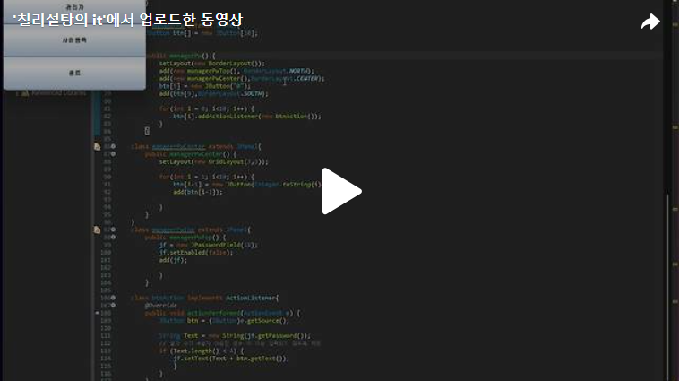

안녕하세요. Day2에서 만든 Main폼에서 관리자버튼을 눌렀을때 실행되는 부분에 대해 작성해보도록 하겠습니다.<br>
아래에 보이는 그림처럼 조건들을 확인하면서 만들어보도록 하겠습니다!<br>
Day2에서 만든 Main에서 이어져 나가는 것이기에 Day2에서 작성한 코드에서 추가로 작성하겠습니다.<br>


<br>
처음에 [그림 2-16]에 보이는 것처럼 Panel을 만들어보도록 하겠습니다.<br>
근데 여기서 중요하게 봐야할 부분이 있습니다. [그림 2-16]을 보면 바로 JOptionPane 위에 Panel이 올라간 것입니다.<br>
따라서 JOptionPane에 managerPw를 올리겠습니다.<br>
[그림 2-16]에 보이는 "확인","취소"버튼은 따로 만드는 것이 아닌 JOptionPane의 YES_NO_OPTION을 사용한 것이고 입력한 문자열을 '●'로 표시하기 위해 패스워드입력부분에 JTextField가 아닌 JPasswordField를 사용하였습니다. <br>

<br>
<br>


<br>조건 3) / 조건4)<br>
<br>
조건 3: PW에 '0000'을 입력하고 [확인] 버튼을 누르면 폼이 종료되고 [그림 2-18]의 [관리] 폼이 실행되도록 하시오. 이외의 패스워드 입력 시 [그림 2-17]의 메시지가 출력되어 더 이상 진행되지 않도록 하시오.<br>
조건 4: [취소] 버튼을 누르면 폼이 종료되도록 하시오.<br>

<br>

조건 3에 보면 성공하면 [그림 2-18]인 폼이 만들어져야 합니다. <br>
[그림 2-18]의 폼은 다음시간에 만들도록 하겠습니다!<br>

[](https://tv.kakao.com/v/449141385)<br>

아래의 코드는 Day2의 코드에 오늘 작성한 부분을 추가한 코드입니다.<br>
```java
package ticket_ui;

import java.awt.BorderLayout;
import java.awt.Container;
import java.awt.GridLayout;
import java.awt.event.ActionEvent;
import java.awt.event.ActionListener;

import javax.swing.JButton;
import javax.swing.JFrame;
import javax.swing.JOptionPane;
import javax.swing.JPanel;
import javax.swing.JPasswordField;


public class main extends JFrame{
	
	JPasswordField jf;
	
	public main() {
		setTitle("메인");
		setDefaultCloseOperation(JFrame.EXIT_ON_CLOSE);
		Container  c = getContentPane();
		//Gridlayout으로 영역나누기
		c.setLayout(new GridLayout(4, 1));
		String menuString[] = {"사용자","관리자","사원등록","종료"};
		JButton btn[] = new JButton[menuString.length];
		
		for(int i = 0; i<btn.length; i++) {
			btn[i] = new JButton(menuString[i]);
			add(btn[i]);
			btn[i].addActionListener(new Action());
		}
		
		
		setSize(300,300);
		setVisible(true);
	}
	class Action implements ActionListener{
		@Override
		public void actionPerformed(ActionEvent e) {
			JButton jbtn = (JButton)e.getSource();
			
			if(jbtn.getText().equals("사용자")) {
				ticket_ui.User u = new User();
			}else if(jbtn.getText().equals("관리자")) {
				managerPw mp = new managerPw();
				int result = JOptionPane.showConfirmDialog(null,mp ,"결제자 인증",JOptionPane.YES_NO_OPTION, JOptionPane.QUESTION_MESSAGE);
				
				if(result ==JOptionPane.YES_OPTION) {
					if(new String(jf.getPassword()).equals("0000")) {
						System.out.println("성공");			
					}else {
						JOptionPane.showMessageDialog(null, "패스워드가 일치하지 않습니다.","Message",JOptionPane.ERROR_MESSAGE);
	                    dispose();
					}
				}
				
			}else if(jbtn.getText().equals("사원등록")) {
				
			}else {
				dispose();
			}
			
		}
	}
	
	class managerPw extends JPanel{
		JButton btn[] = new JButton[10];
		
		
		public managerPw() {
			setLayout(new BorderLayout());
			add(new managerPwTop(), BorderLayout.NORTH);
			add(new managerPwCenter(),BorderLayout.CENTER);
			btn[9] = new JButton("0");
			add(btn[9],BorderLayout.SOUTH);
			
			for(int i = 0; i<10; i++) {
				btn[i].addActionListener(new btnAction());
			}
		}
	
	class managerPwCenter extends JPanel{
		public managerPwCenter() {
			setLayout(new GridLayout(3,3));
			
			for(int i = 1; i<10; i++) {
				btn[i-1] = new JButton(Integer.toString(i));
				add(btn[i-1]);

			}
		}
	}
	class managerPwTop extends JPanel{
		public managerPwTop() {
			jf = new JPasswordField(18);
			jf.setEnabled(false);
			add(jf);
			
			}
		}
	
	class btnAction implements ActionListener{
		@Override
		public void actionPerformed(ActionEvent e) {
			JButton btn = (JButton)e.getSource();
			
			String Text = new String(jf.getPassword());
            // 글자 수가 4글자 이상인 경우 더 이상 입력되지 않도록 제한
            if (Text.length() < 4) {
                jf.setText(Text + btn.getText());
            	}	
			}	
		}

	}

	public static void main(String[] args) {
		main m = new main();
	}

}


